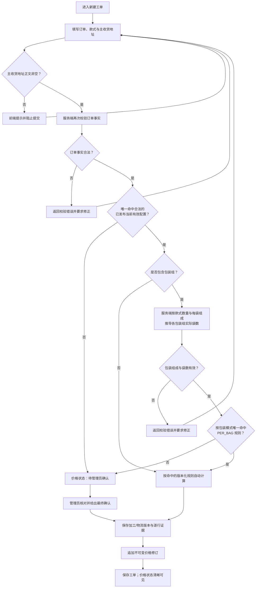
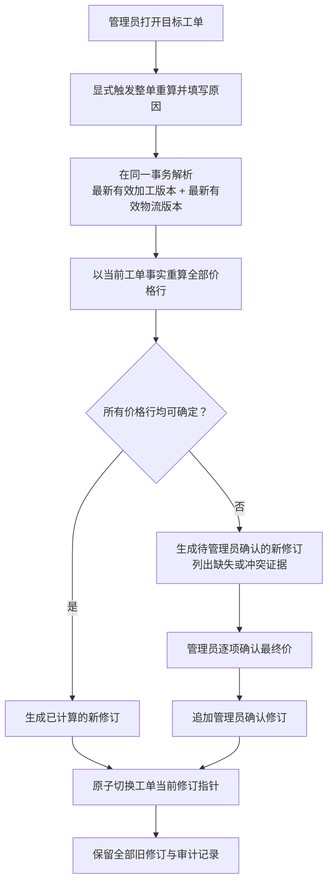
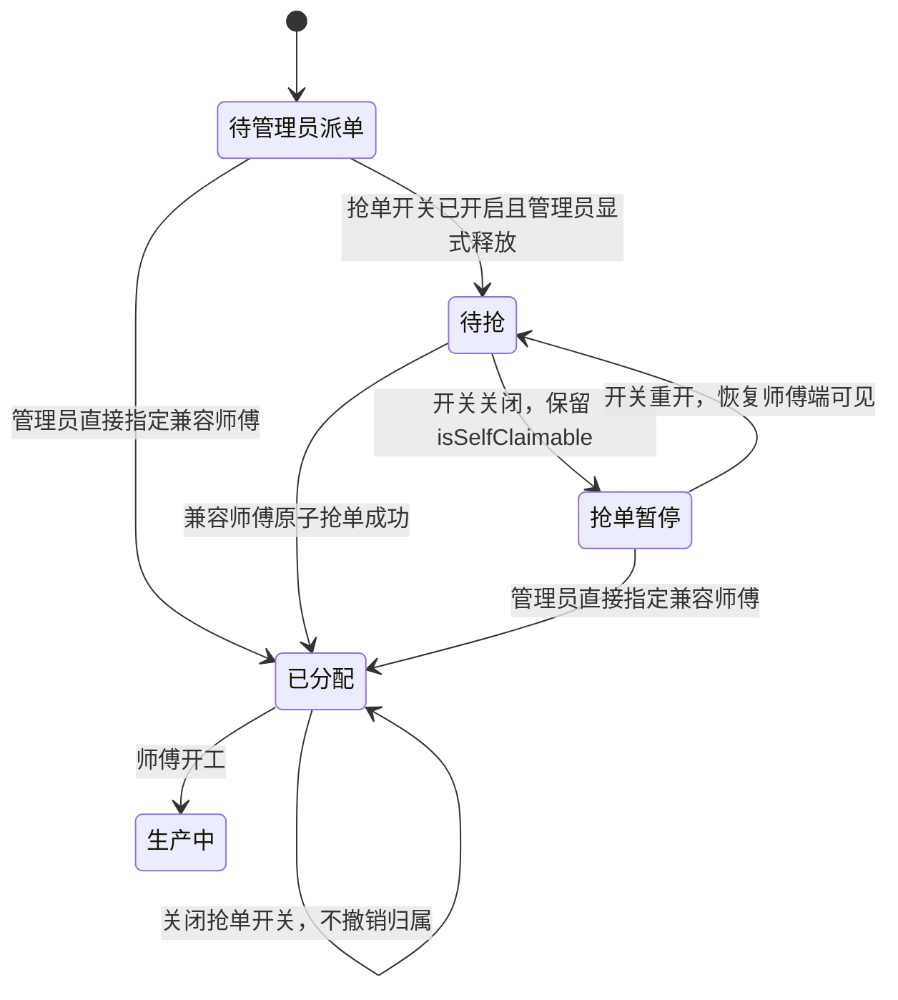
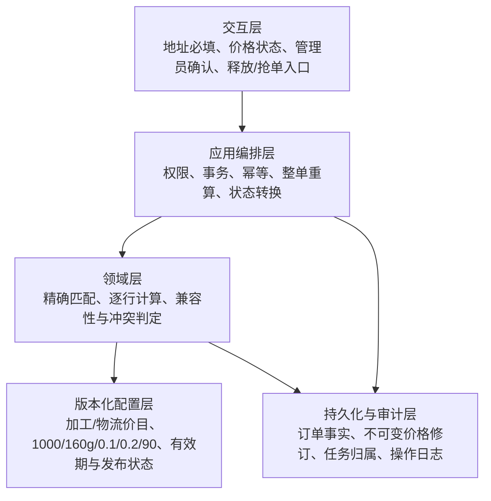

# 工单定价与派单 V2 设计

> 状态：已确认的实施契约
> 适用范围：新建工单、工单核价/重算、管理员派单与可选抢单
> 原则：价格来自已发布版本，人工确认必须可见，任何重算与归属变化都可追溯。

## 1. 已确认规则

| 领域 | V2 契约 |
| --- | --- |
| 新建工单 | 创建时必须填写至少一个主收货地址；主收货地址正文为空白时，前端与服务端都拒绝创建。其他收件字段继续沿用现有校验。 |
| 彩印自动计价 | 只有订单事实完整，并且**精确命中合法、已发布、当前有效**的配置时才自动计算。不得用相邻档位、经验值或插值补价。 |
| 报价 SKU | 外部销售创建页只展示唯一当前生效加工价目中启用基础规则绑定的产品 ID；产品编码前缀不决定是否可报价，未被当前版本引用的启用产品也不进入报价目录。 |
| 合法但未定价的工艺 | 专版双面、彩印反面烫金等结构合法的事实必须进入版本引擎，由阻断规则转“待管理员确认”；schema 只拒绝每面超色、缺少必要工艺等非法事实。 |
| 未确认价 | 未命中配置、命中阻断规则或输入证据不足时，标记为“待管理员确认”；该金额不得在界面、接口或下游流程中伪装成最终价。 |
| 工厂调价 | 发布价目不会静默改写存量工单。只有管理员显式触发“整单重算”时，才使用触发时最新有效的加工与物流版本重新计算整张工单。 |
| 价格修订 | 每次创建、管理员确认或整单重算都追加不可变修订；旧修订不得覆盖或删除。 |
| 规则来源 | `1000` 边界、`160g` 基准、入袋 `0.1/0.2` 和调版 `90` 都属于当前价目规则版本，不得写死在 UI、Action 或领域服务的计价分支中。迁移只能把这些值写成版本化配置数据，不得另建旁路公式或覆盖历史版本。边界是否包含端点也由版本化规则表达。 |
| 入袋自动计价 | 包装组、每袋组成和实际袋数已经是结构化订单事实。服务端按款式数量与每袋组成推导实际袋数，再按包装模式精确匹配当前已发布、当前有效的加工费 `PER_BAG` 规则并自动计费。当前规则版本为单款装 `0.1` 元/袋、混装 `0.2` 元/袋；金额属于版本化配置，不是永久常量。每个包装组只能命中一种模式规则，不得把单款装与混装重复累加。 |
| 快递自动计价 | 中通且整单总数量不超过 `2000` 个时，服务端按当前物流版本中的单个克重表估算净重，向上取整到 kg，最低按 1kg；已有履约实际重量时实际重量优先。超过数量边界、缺少克重映射、地址/承运商不支持或规则冲突时转管理员终价。 |
| 默认派单 | 默认由管理员直接指定兼容师傅。 |
| 可选抢单 | 开关启用后，任务仍不会自动进入抢单池；必须由管理员逐项显式释放，师傅才能在兼容性校验通过后抢单。 |
| 关闭抢单 | 关闭开关后暂停新的释放与抢单；已抢任务保持原归属，不自动撤销。池中未抢任务保留 `isSelfClaimable` 标记，但师傅端不可见且抢单 Action 拒绝；管理员仍可直接派单，重开后未抢任务恢复可见。 |

## 2. 新建与定价流程

自动计算必须满足全部条件：

1. 配置已发布、处于有效期内，并与当前订单组织/渠道等作用域一致。
2. 所需输入完整，且规则条件精确匹配；多个规则冲突时不得自行选择更贵或更便宜的一条。
3. 包装组必须满足单款装只含一个款式、混装至少含两个款式，且各款数量与每袋组成能推导出相同袋数；浏览器提交的袋数不作为可信计价依据。
4. 每个包装组按模式唯一命中一条未阻断自动报价的 `PER_BAG` 规则；单款装与混装规则互斥，不在同一包装组内叠加。
5. 快递费优先读取管理员或履约流程保存的实际重量；没有实际重量时，中通且整单总数量不超过 `2000` 个可按当前物流版本的结构化克重表在服务端估算。浏览器重量与历史报价重量均不得作为输入；超过数量边界、缺少映射或不支持的地区/承运商转管理员终价。
6. 计算结果记录规则标识、价目簿标识与版本、输入快照、逐行金额和舍入结果。

订单事实非法时应返回结构化校验错误并要求修正，不得把错误事实交给管理员猜价。订单事实合法但价格版本或规则无法唯一确定时，应返回结构化的“待管理员确认”原因，而不是返回猜测金额或静默使用默认值。

## 3. 工厂调价后的整单重算

整单重算的实现约束：

- 只能由具备权限的管理员显式触发；读取工单、发布新价目或定时任务都不得自动重算。
- 加工与物流版本在一次重算事务中共同解析并冻结；不得只更新部分价格行。
- 新修订写入成功后才切换当前修订；失败时旧修订仍是完整可用的当前版本。
- 修订至少保留：工单输入快照、加工/物流价目簿及版本、命中规则、逐行金额、总额、状态、触发人、触发时间、原因，以及上一修订标识。
- 历史修订只读。价目规则之后再次发布，不改变历史计算证据。

## 4. 派单与抢单流程

兼容性与并发约束：

- 释放前和抢单提交时都重新校验账号启用状态、角色、工艺/设备等硬兼容条件。
- 抢单必须是原子操作；并发请求只能有一个成功，失败方得到明确的“已被领取”结果。
- 开关关闭时，查询层隐藏池中未抢任务，抢单 Action 同时拒绝请求；不批量改写已分配任务，也不清除未抢任务的 `isSelfClaimable` 标记。
- 直接派单、释放、收回、抢单与失败原因都写入审计日志。

## 5. 系统分层与责任边界

责任边界：

- 交互层只收集事实和展示状态，不复制价格常量，也不决定规则优先级。
- 应用层负责一次操作的权限、幂等和原子性，不自行补价。
- 领域层只消费订单事实与已解析的规则版本；无法确定时返回待确认原因。
- 配置层是价格数字、条件边界和有效期的唯一来源。
- 持久化层保存不可变证据；“当前价格”只是指向某个修订的引用。

## 6. 规则配置中心

管理端只保留一个可见菜单入口：`/owner/rules`。旧的价格与工资规则 URL 使用临时重定向进入下列 canonical 路由，不再形成第二套可修改入口。

| 模块 | Canonical 路由 | 当前能力 |
| --- | --- | --- |
| 客户加工费与物流 | `/owner/rules/customer-pricing` | 维护已建立的现货、专版、彩印、快递与耗材规则 |
| 价格版本与发布 | `/owner/rules/price-versions` | 草稿、计划生效版本、当前版本与历史版本 |
| 内部兼容价格 | `/owner/rules/internal-pricing` | 仅供内部销售/工厂直单的价格阶梯与加价规则 |
| 师傅计件 | `/owner/rules/worker-piecework` | 查看机型默认规则，管理师傅个人覆盖版本 |
| 员工工资与提成 | `/owner/rules/employee-pay` | 管理员工工资与提成规则版本 |

产品/SKU、工艺字典和管理员终价确认属于“计价对象与核价入口”，由中心关联进入，不冒充价格规则本身。包装组、每袋组成和实际袋数属于工单事实；单款装/混装的每袋金额属于加工费价目规则，在客户计价中随价格版本维护。`0.1/0.2` 只描述当前已发布版本，不作为页面或运行时代码中的固定公式。尚未建立数据模型的尺寸计价组、独立审批策略和可配置舍入策略继续标为“尚不可配置”，不提供无效表单。

规则中心的日常管理界面只显示中文业务名称、适用范围、数量、计价方式、金额和版本状态。`STOCK_BLANK`、`CUSTOM_SINGLE_FLAT_FOIL`、`COLOR_PRINT` 等内部枚举，以及工艺 code、JSON key、匹配操作符和公式变量，只用于存储、接口、日志和测试，不作为可见标题、徽标、说明或输入要求。低频适用条件默认折叠，一个业务事实不在总览、独立说明页和编辑器中重复解释。

## 7. 实施顺序

1. **契约收口**：统一价格状态、待确认原因、价格修订和任务释放状态的命名；先补服务端不变量测试。
2. **创建链路**：保证主收货地址前后端必填；保存每次核价所用加工/物流版本和逐行证据。
3. **入袋自动计价**：以包装组、每袋组成和服务端推导袋数为事实，按包装模式唯一匹配当前加工费版本并保存逐组证据。
4. **人工确认**：只为事实不完整、规则缺失/冲突/阻断等未确认价提供管理员入口与审计；完整自动价不接受浏览器或管理员静默覆盖。
5. **整单重算**：新增显式管理员命令，原子生成修订并保留旧版；禁止发布价目时批量静默更新。
6. **派单开关**：先保持管理员派单默认路径，再增加显式释放、兼容性抢单与并发保护。

## 8. 最小验收清单

- [x] 主收货地址为空或只有空白字符时，前端与服务端都拒绝创建；合法地址可创建。
- [x] 彩印精确命中合法已发布配置时自动计算，并能追溯到规则与版本。
- [x] 当前加工价目绑定的 `PRD-*` 或其他编码产品能进入外部销售报价目录；遗留 `EXT-*` 产品未被当前版本引用时不会凭编码混入。
- [x] 专版双面与彩印反面烫金通过事实校验后命中版本化阻断规则并进入待管理员确认；每面 4 色等非法事实仍被拒绝。
- [x] 彩印缺档、配置未发布/过期、输入不足或规则冲突时进入待确认，不发生插值或兜底。
- [x] 单款装只接受一个款式，混装至少接受两个款式；服务端根据款式数量与每袋组成重新推导实际袋数，不信任浏览器传入的袋数。
- [x] 当前加工费版本下，单款装 20 袋按 `0.1` 元/袋自动计为 `2.00` 元，混装 15 袋按 `0.2` 元/袋自动计为 `3.00` 元；两组只汇总一次，合计 `5.00` 元。
- [x] 每个包装组按模式只命中一条互斥规则；同一包装组不会同时累加单款装与混装费用。
- [x] 包装组成或袋数推导非法时拒绝创建并要求修正；当前无唯一有效加工费版本、规则缺失/冲突/阻断或金额非法时，入袋费进入待管理员确认，不把零元占位或猜测金额当作最终价。
- [x] 自动入袋费快照保存价目簿与版本、包装模式、实际袋数、命中规则、每袋费率、小计和舍入方式。
- [x] 服务端入袋计价只读取当前有效价格版本；迁移和测试数据可以记录该版本的 `0.1/0.2`，运行时计价分支不得写死这两个金额。
- [x] Form B 的包装模式只陈述“单款装/混装”事实，不再显示静态 `0.1/0.2` 费率；费用栏仅展示服务端当前版本报价的实际金额。
- [x] 外部销售伪造或历史遗留的报价重量不参与快递费计算，也不能清空管理员已录入的实际重量；缺少实际重量时，服务端按当前物流版本估算，实际重量一旦存在即优先覆盖估算。
- [x] 当前物流版本以《加工费计费规则.md》§6 为重量策略来源：`120/150/160/180/200/230g` 单重分别为 `4.5/6/6/6.75/8/10g`，万元封为 `10g`；净重按整单逐款累加，向上取整到 kg，最低 1kg。
- [x] 中通自动估算仅适用于整单总数量不超过 `2000` 个；`2000` 个 `160g` 发往上海估算 `12kg`，当前费率结果为 `¥41.30`。超过 `2000` 个或缺少可计算事实时保持待管理员终价。
- [x] 发布新价目不会改变存量工单；显式整单重算同时采用触发时最新有效加工与物流版本。
- [x] 重量策略发布会覆盖完整的当前及未来物流时间线：每个已排期物流段均派生同窗口 successor，保留该段费率、规则、来源和非策略 notes，并叠加 `SERVER_ESTIMATE_WITH_ACTUAL_OVERRIDE`；原未来段停用但不改写，避免到期后回退旧重量口径。
- [x] 重算失败不会覆盖当前修订；重算成功后新旧修订和差额均可审计。
- [x] 抢单开关关闭时只能管理员派单；开启后未显式释放的任务仍不可抢。
- [x] 不兼容师傅不能抢单；并发抢同一任务只有一个成功。
- [x] 关闭抢单开关不撤销已抢任务，也不清除池中未抢任务的 `isSelfClaimable`；未抢任务在师傅端不可见、抢单 Action 拒绝，管理员仍可直接派单，重开后恢复可见。

## 9. 明确不做

- 不把事实与规则完整的入袋费重新转成人工确认；包装事实不合法时必须先修正，只有事实合法但规则缺失/冲突/阻断或金额非法时才进入管理员核价。
- 不信任浏览器传入的实际袋数，也不以 UI 静态展示的 `0.1/0.2` 作为结算依据。
- 不在同一包装组内同时累加单款装与混装规则，也不跨包装组错误合并袋数。
- 不修改历史价目版本或历史价格修订。
- 不使用浏览器金额、浏览器重量、相邻档位或未发布常量臆造价格；符合当前物流版本边界时，必须执行该版本明确发布的数量与克重估算公式。
- 不因开启抢单而自动释放全部任务，也不因关闭开关而撤销已抢任务或改写池中未抢任务的抢单标记。
