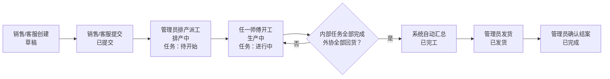
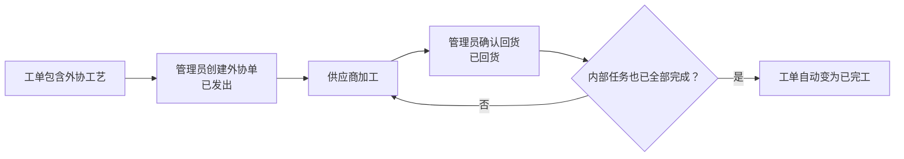

# 红包印刷 ERP 管理后台使用手册

> 适用版本：当前生产版本
> 更新日期：2026-07-21
> 使用地址：<https://bag.sshapi.cn>

本文面向实际使用系统的同事，说明不同账号能做什么、工单如何在销售、管理员和师傅之间流转，以及外协、采购、库存、账单和工资如何衔接。

本文只描述当前已经上线的功能。侧栏中显示为灰色、无法点击的项目属于待实现功能，不应作为当前工作流程使用。

## 1. 登录与账号

### 1.1 登录

1. 打开 <https://bag.sshapi.cn>。
2. 输入管理员分配的用户名和密码。
3. 登录后，系统会按账号角色自动进入对应工作台：

| 账号角色 | 登录后的默认页面 | 使用终端建议 |
|---|---|---|
| 管理员 | Dashboard | 电脑或平板 |
| 销售 | 我的工单 | 电脑或平板 |
| 客服 | 我的工单 | 电脑或平板 |
| 师傅 | 我的任务 | 手机 |

请勿共用账号。工单提交、状态变化、报工和后台修改都会记录实际操作人，共用账号会导致责任记录和工资归属错误。

### 1.2 修改密码与退出

- 管理员、销售、客服：点击右上角姓名或头像，选择“修改密码”或“退出登录”。
- 师傅端：顶部提供“退出登录”；需要修改密码时可打开 `/account/password`。
- 新密码至少 8 位。管理员可以在“用户管理”中重置员工密码。
- 建议首次登录后立即修改初始密码。

账号停用后不能登录，但历史工单、报工、工资和操作记录都会保留。

## 2. 账号角色与功能边界

### 2.1 功能对照表

| 功能 | 管理员 | 销售 | 客服 | 师傅 |
|---|:---:|:---:|:---:|:---:|
| 查看全部工单 | ✓ | — | — | — |
| 查看自己的工单 | ✓ | ✓，自己创建的 | ✓，自己创建的 | ✓，有任务分配给自己的 |
| 创建、提交工单 | ✓ | ✓ | ✓ | — |
| 排产、派工、改派 | ✓ | — | — | — |
| 开始任务、报工 | — | — | — | ✓，仅自己的任务 |
| 创建和处理外协单 | ✓ | — | — | — |
| 取消工单 | ✓ | — | — | — |
| 发货、确认完成 | ✓ | — | — | — |
| 查看销售应收账单 | 全部 | 自己的 | 数据会参与客服业绩，当前侧栏无独立入口 | — |
| 查看师傅工资 | 全部 | — | — | 自己的计件工资 |
| 采购、库存、仓库 | ✓ | — | — | 当前工作台无操作入口 |
| 字典、账号、推送、运维 | ✓ | — | — | — |

### 2.2 管理员账号

管理员承担业务配置、排产、财务和运维管理。当前主要菜单包括：

| 菜单分组 | 功能 |
|---|---|
| Dashboard | 查看待办、生产与经营概览、待发货工单、异常提醒 |
| 工单 | 查看所有工单，修改允许修改的信息，取消、发货、确认完成 |
| 排产 | 给每个款式的内部工艺选择符合岗位和机型的师傅 |
| 外协 | 创建外协单，登记外协回货或取消外协 |
| 采购单 | 创建采购单、分批收货、取消采购单或收货单 |
| 车间用料 | 查看物料库存和办理出入库 |
| 工时录入 | 为打包工、清废工、厨师登记普通、加班和空闲打包工时 |
| 账单 | 生成销售/客服月度应收账单、发单、登记付款 |
| 薪资 | 管理计件规则、日计件工资、客服周期和时薪工月结 |
| 客户/供应商 | 维护客户、供应商及默认联系人和地址 |
| 工艺、产品、分类、价格 | 维护录单和排产使用的基础资料 |
| BOM/用料 | 维护产品或分类的估算用料；目前不会自动扣库存 |
| 物料、仓库/库位 | 维护物料主数据、仓库、库位、调拨和盘点 |
| 用户管理 | 新建、编辑、停用账号和重置密码 |
| 推送配置 | 配置企业微信群及业务事件推送规则 |
| 后台任务 | 查看通知、定时结算和文件打包任务，重试失败任务 |
| CDR 汇总 | 按工单生成外协设计文件 ZIP 下载链接 |
| Pigsty 运维 | 查看数据库扩展、调度和分区预检；主要供运维人员使用 |

当前没有单独的“车间主任”角色。系统中 `/foreman` 路径和“排产、外协、车间用料、工时录入”等页面名称沿用了旧命名，实际权限都属于管理员。

### 2.3 销售账号

销售当前可使用：

- 创建工单；
- 查看自己创建的工单；
- 在允许的阶段修改自己工单的基本信息；
- 将自己的草稿工单提交给管理员排产；
- 标记或取消急单标记，但仅限排产前；
- 打印工单或下载 PDF；
- 查看自己的月度应收账单和回款进度。

销售不能排产、指定师傅、处理外协、取消工单、发货或确认完成。如需这些操作，应联系管理员。

“我的 Dashboard”和“报价查询”目前是灰色占位项，尚未上线。

### 2.4 客服账号

客服的录单权限与销售相同：

- 创建、查看和提交自己创建的工单；
- 排产前修改自己工单的基本信息；
- 上传草稿工单的设计文件；
- 打印工单或下载 PDF。

客服工单在完成、结案并产生回款后，会由管理员侧的账单与“客服周期”功能累计业绩和计算提成。

“我的 Dashboard”“我的业绩”“我的工资单”和“报价查询”目前是灰色占位项，尚未上线。客服侧栏目前不提供独立账单入口，相关账单和提成由管理员处理。

### 2.5 师傅账号

师傅端针对手机使用，包含三个入口：

| 页面 | 用途 |
|---|---|
| 我的任务 | 只显示分配给当前师傅的待开始、进行中任务；急单优先，其余按派工先后排列 |
| 我的工单 | 查看至少有一个任务分配给自己的工单，包括已完成的历史工单 |
| 我的计件工资 | 查看自己的日计件工资、是否发放以及关联工单明细 |

师傅分为四种岗位：

| 岗位 | 当前计薪和使用方式 |
|---|---|
| 开机师傅 | 按分配的生产任务开工、报工，并按机型计件；账号还需配置机型 |
| 打包工 | 可接对应生产任务；任务用于生产进度，工资按考勤时薪结算 |
| 清废工 | 可接对应生产任务；任务用于生产进度，工资按考勤时薪结算 |
| 厨师 | 不参与生产工艺派工，由管理员录入考勤，按月薪及空闲打包工时结算 |

师傅只能开始和报工分配给自己的任务，不能替其他师傅报工，也不能自行改派任务。

## 3. 工单完整流转

工单主状态和师傅任务状态是两套相互关联的状态：

- 工单状态表示整张订单走到哪一步；
- 生产任务状态表示某位师傅负责的某项工艺做到哪一步。

### 3.1 工单状态说明

| 页面状态 | 系统状态 | 含义 | 下一主要操作人 |
|---|---|---|---|
| 草稿 | `DRAFT` | 已保存但尚未进入排产队列 | 销售/客服检查并提交 |
| 已提交 | `SUBMITTED` | 等待管理员排产 | 管理员 |
| 排产中 | `SCHEDULING` | 已创建任务，等待师傅开工 | 师傅 |
| 生产中 | `IN_PRODUCTION` | 至少一项内部任务已开工 | 师傅/管理员 |
| 已完工 | `COMPLETED` | 内部任务完成，所需外协已回货 | 管理员发货 |
| 已发货 | `SHIPPED` | 货物已经发出 | 管理员确认结案 |
| 已完成 | `FINISHED` | 已交付并关闭，进入账单归集范围 | 无，终态 |
| 已取消 | `CANCELLED` | 工单作废 | 无，终态 |

### 3.2 生产任务状态说明

| 页面状态 | 系统状态 | 师傅操作 |
|---|---|---|
| 待开始 | `PENDING` | 打开任务并点击“开始生产” |
| 进行中 | `IN_PROGRESS` | 填写合格数、不良数、返工数并报工 |
| 已完工 | `COMPLETED` | 只读，不能再次修改或报工 |
| 已取消 | `CANCELLED` | 只读，不能开工或报工 |

## 4. 销售/客服操作步骤

### 4.1 创建工单

1. 进入“创建工单”。
2. 填写客户名称/简称（选填）和收货信息。
3. 填写承诺交期、包装要求、备注，按需要标记急单。
4. 添加一个或多个款式，填写产品、名称、规格、纸张、数量、单价、单双面、单双色和工艺。
5. 检查金额和工艺后保存，系统生成工单号并进入“草稿”。
6. 如有图片或 CDR 设计文件，在草稿阶段进入工单详情，按款式上传。

注意：

- 设计文件只有在“草稿”状态才能增删，提交前务必检查完整；
- 当前编辑页只能修改工单顶部信息，不能增加、删除或修改款式；
- 款式、数量、单价或工艺录错时，应联系管理员取消错误工单，再重新创建；
- 停用的客户、产品或工艺不会出现在新建工单选项中，但不会影响历史工单。

### 4.2 提交工单

1. 打开“我的工单”，进入目标草稿。
2. 检查客户、交期、款式、数量、工艺、金额和设计文件。
3. 点击“提交工单”。
4. 状态变为“已提交”，工单进入管理员的待排产列表。

提交后仍可在排产前修改顶部信息，但不能再增删设计文件。排产开始后，销售和客服不能修改工单；收货信息变动应联系管理员处理。

### 4.3 跟踪工单

在“我的工单”中查看状态：

- “已提交”：等待管理员排产；
- “排产中”：已派给师傅，尚未正式开工；
- “生产中”：至少一位师傅已经开工；
- “已完工”：生产和外协都已结束，等待发货；
- “已发货”：货物已发出；
- “已完成”：已结案，会按结案月份进入月度账单；
- “已取消”：工单已经作废。

销售还可以在“我的账单”查看管理员生成的月度账单、账单总额、已付款金额和结清状态。销售端账单为只读，发单和登记付款由管理员操作。

## 5. 管理员排产与生产管理

### 5.1 排产前准备

排产成功必须同时满足：

1. 工单状态为“已提交”；
2. 每个内部工艺已经配置所需岗位；
3. 开机工艺已经配置机型；
4. 至少有一名启用状态、岗位和机型匹配的师傅；
5. 如果工单包含外协工艺，已经先创建关联外协单。

没有匹配师傅时，先到“用户管理”检查师傅账号的岗位、机型和启用状态，再到“工艺字典”检查工艺的默认岗位和机型。

### 5.2 确认排产

1. 进入“排产”。列表只显示“已提交”工单，急单优先。
2. 打开目标工单。
3. 为每一个“款式 × 内部工艺”选择一名匹配师傅。
4. 外协工艺不选择师傅，改由外协单处理。
5. 所有内部工艺都派工后，点击“确认排产”。

排产成功后：

- 工单变为“排产中”；
- 每项内部工艺生成一个“待开始”任务；
- 对应师傅在“我的任务”中看到任务；
- 只要第一位师傅开始任务，工单自动变为“生产中”。

### 5.3 改派任务

管理员可在工单详情的“未开工任务改派”区域更换师傅，但只能改派“待开始”任务。

已经开工或完成的任务不能改派，因为任务已经绑定实际操作人、报工记录和工资归属。需要处理异常时，不要新建重复任务或让其他师傅共用账号，应由管理员先核实生产和工资记录。

## 6. 师傅开工与报工

### 6.1 开始任务

1. 登录师傅工作台，打开“我的任务”。
2. 优先处理带“急单”标记的任务，其余按列表顺序处理。
3. 打开任务，核对工单号、款式、工艺、机型、计划数量和单双面/单双色。
4. 确认无误后点击“开始生产”。

任务变为“进行中”。如果这是整张工单第一个开始的任务，工单会自动从“排产中”变为“生产中”。

如果系统提示岗位或机型不匹配、账号停用或任务已取消，请停止操作并联系管理员改派或检查账号配置。

### 6.2 报工

任务必须先点击“开始生产”，不能从“待开始”直接报完工。

1. 打开进行中的任务。
2. 填写合格数、不良数和返工数。
3. 核对数量后提交报工。
4. 报工成功后任务变为“已完工”。

开机师傅报工时，系统会根据任务的机型、单双面、单双色和报工数量计算板数、印次及计件金额，并保存当时生效的工资规则。打包工和清废工的任务也会推动生产进度，但工资根据管理员录入的考勤按时薪结算。

当所有内部任务都完成，且所需外协都已回货时，系统会自动把工单变为“已完工”。师傅不需要也不能手动修改工单主状态。

### 6.3 查看工资

开机师傅可在“我的计件工资”中查看：

- 每日计件合计；
- 保底工资和人工调整；
- 实发金额；
- 是否已经发放；
- 关联工单和任务明细。

如果已经报工但工资页面暂时没有记录，通常是管理员尚未执行该日工资重算。请联系管理员核对，不要重复报工。

## 7. 外协流程

外协工艺不会生成内部生产任务，而是通过独立外协单管理。

操作要求：

1. 管理员在工单详情点击“外协”，选择关联款式并填写外协厂、工艺、数量、金额、预计回货日期和要求。
2. 新建外协单后默认状态为“已发出”。
3. 供应商回货后，管理员进入外协单点击“标记回货”。
4. 当前操作界面支持从“已发出”直接标记为“已回货”，或在尚未回货时取消外协单。
5. 纯外协工单没有内部任务，最后一张有效外协单回货后，可以直接从“排产中”变为“已完工”。

以下情况会被系统阻止：

- 工单包含外协工艺但未创建外协单时，不能确认排产；
- 仍有“已发出”或“进行中”的外协单时，不能发货；
- 仍有“已发出”或“进行中”的外协单时，不能直接取消工单。

## 8. 发货、结案与取消

### 8.1 发货和结案

只有管理员可以操作：

1. 工单自动变为“已完工”后，在详情页填写运单号并点击“标记发货”；
2. 工单变为“已发货”；
3. 客户确认收货、交付和对账完成后，管理员点击“确认完成”；
4. 工单变为“已完成”，成为终态。

只有“已完成”的工单才会按 `finishedAt` 所在月份进入销售/客服月度账单。不要把“已完工”当作业务结案，否则账单不会归集该工单。

### 8.2 取消工单

只有管理员可以取消工单。取消前必须检查生产和外协状态：

- 全部任务都还未开工时，可以取消；所有“待开始”任务会同时变为“已取消”；
- 只要有任务已经开工或报工，不能直接取消，必须先核实并处理生产、计件和工资记录；
- 有“已发出”或“进行中”的外协单时，必须先处理外协单；
- “已完成”和“已取消”是终态，不能继续流转。

如销售或客服发现错误，应尽快通知管理员，并提醒相关师傅暂时不要开工。师傅一旦开工，系统会阻止直接取消。

## 9. 采购与库存流程

### 9.1 基础关系

### 9.2 操作原则

- 创建采购单只记录采购承诺，不会增加库存；
- 实际到货后，应在采购单详情中创建收货单；
- 只有“收货过账”才会增加对应物料和库位库存；
- 支持分批收货，采购单状态会从“已下单”变为“部分收货”，全部收齐后变为“已收货”；
- 取消已经过账的收货单会产生反向库存记录，不要通过手工修改物料主数据纠正库存；
- 库存调拨用于不同仓库或库位之间移动库存，不改变公司总库存；
- 库存盘点提交后会根据账面数和实盘数生成差异流水；
- BOM 当前只提供用料估算，不会在工单报工或完工时自动扣库存。

## 10. 账单与工资流程

### 10.1 销售/客服应收账单

- 系统按上海时区的自然月，将当月“已完成”工单按提交人归集；
- 每位销售或客服每月一张账单；
- 草稿账单由管理员核对后发单；
- 登记回款时累计已付金额，不能超过账单总额；
- 客服账单的实际回款会同时累计到客服业绩周期；销售账单不进入客服提成系统；
- 销售侧只能查看自己的账单，不能发单或登记付款。

### 10.2 开机师傅计件工资

1. 管理员先在“计件规则”维护机型统一规则或师傅个人规则；个人规则优先生效。
2. 师傅报工时，系统计算计件并把命中的规则保存到任务快照。
3. 管理员在“计件工资”按日期重算全员日薪。
4. 系统按计件合计与当日保底取较高值，再叠加人工调整。
5. 管理员核对明细后标记发放；标记发放后记录锁定。

### 10.3 打包工、清废工和厨师工资

1. 管理员每天在“工时录入”登记考勤。
2. 打包工、清废工记录普通工时和加班工时；厨师还可记录空闲打包工时。
3. 月末在“时薪工月结”重算当月工资。
4. 管理员核对后标记发放；已标记发放的记录不能重新计算。

机器师傅不录考勤时薪，打包工、清废工和厨师不走开机计件规则。

## 11. 管理员首次配置检查表

新环境或新业务上线前，管理员按以下顺序检查：

1. 在“用户管理”创建销售、客服和师傅账号；
2. 为师傅选择正确岗位，开机师傅必须选择机型；
3. 在“客户/供应商”维护客户和供应商；
4. 在“产品分类、产品字典、工艺字典”维护录单选项；
5. 为内部工艺配置所需岗位，开机工艺配置机型；
6. 为外协工艺打开外协标记；
7. 在“计件规则”维护开机师傅工资规则；
8. 在“物料、仓库/库位”维护库存基础资料；
9. 按需要维护价格阶梯和 BOM；
10. 在“推送配置”创建企业微信群并启用对应事件规则；
11. 创建一张测试工单，完整走通提交、排产、开工、报工、发货和完成。

## 12. 常见问题

### 为什么销售看不到其他人的工单？

这是权限设计。销售和客服只能查看自己创建的工单；管理员可以查看全部工单。

### 为什么师傅看不到某张工单？

师傅只有在管理员把至少一个生产任务派给自己后，才能在“我的工单”看到它。外协工艺不会生成师傅任务。

### 为什么工单提交了，师傅仍看不到？

“已提交”只代表进入待排产队列。必须由管理员完成排产并派工，师傅端才会出现任务。

### 为什么排产页没有合适的师傅？

依次检查师傅账号是否启用、岗位是否匹配、开机师傅机型是否匹配，以及工艺字典是否正确配置默认岗位和机型。

### 为什么工单一直显示“生产中”？

至少还有一个未取消的内部任务没有报完工，或关联外协单尚未全部回货。管理员应在工单详情检查任务和外协状态。

### 为什么不能发货？

工单必须先达到“已完工”，并且不能存在“已发出”或“进行中”的外协单。

### 为什么不能取消工单？

通常是因为已有任务开工/报工，或仍有进行中的外协单。系统阻止直接取消，是为了避免生产记录、外协成本和工资归属不一致。

### 为什么师傅报工后没有工资？

先确认该任务是否属于开机计件岗位。开机师傅的日薪需要管理员按日期重算后才出现在工资列表；打包工、清废工和厨师按考勤结算，不显示为开机计件工资。

### 为什么“我的 Dashboard”“报价查询”等菜单不能点击？

这些是待实现的占位菜单。灰色、无法点击属于正常现象，不是账号权限故障。

### 操作后页面没有立即变化怎么办？

先等待按钮完成处理，不要连续重复点击；随后刷新当前页面确认状态。如果仍未变化，记录工单号、页面、操作时间和错误提示，交给管理员检查“后台任务”或联系技术人员。

## 13. 异常上报需要提供的信息

遇到问题时，请提供：

- 登录账号姓名和角色；
- 工单号、任务或外协单号；
- 操作页面；
- 操作时间；
- 点击了什么按钮；
- 页面完整错误提示；
- 必要时附截图，但不要在群里发送密码或完整敏感客户信息。

涉及报工、工资、回款、库存的异常，不要通过重复提交来“试一下”。重复操作可能形成重复业务记录，应先由管理员或技术人员核对。
