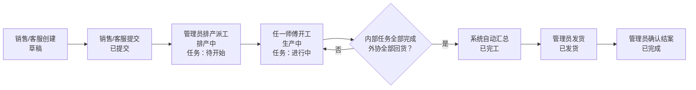
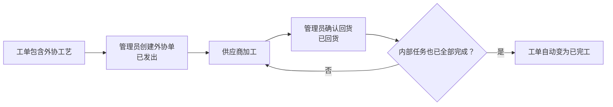

# 红包印刷 ERP 管理后台使用手册

> 适用版本：当前工作区发布候选。生产仍为 `aa42ba0`（2026-08-02 发布）；本次报价、结算分账、外部销售快递/打包耗材收费、供应商付款及 §5.0 筛选/导出需发布后才可使用。
> 更新日期：2026-08-08
> 使用地址：<https://bag.sshapi.cn>

本文面向实际使用系统的同事，说明不同账号能做什么、工单如何在销售、管理员和师傅之间流转，以及外协、采购、库存、账单和工资如何衔接。

本文描述当前发布候选的既有功能；尚未发布部分已在页首注明。侧栏中显示为灰色、无法点击的项目属于待实现功能，不应作为当前工作流程使用。

## 1. 登录与账号

### 1.1 登录

1. 打开 <https://bag.sshapi.cn>。
2. 输入管理员分配的用户名和密码。
3. 登录后，系统会按账号角色自动进入对应工作台：

| 账号角色 | 登录后的默认页面 | 使用终端建议 |
|---|---|---|
| 管理员 | Dashboard | 电脑或平板 |
| 销售 | 我的工单 | 电脑或平板 |
| 客服 | 我的工单 | 电脑或平板 |
| 师傅 | 我的任务 | 手机 |

请勿共用账号。工单提交、状态变化、报工和后台修改都会记录实际操作人，共用账号会导致责任记录和工资归属错误。

### 1.2 修改密码与退出

- 管理员、销售、客服：点击右上角姓名或头像，选择“修改密码”或“退出登录”。
- 师傅端：顶部提供“退出登录”；需要修改密码时可打开 `/account/password`。
- 新密码至少 8 位。管理员可以在“用户管理”中重置员工密码。
- 建议首次登录后立即修改初始密码。

账号停用后不能登录，但历史工单、报工、工资和操作记录都会保留。

## 2. 账号角色与功能边界

### 2.1 功能对照表

| 功能 | 管理员 | 销售 | 客服 | 师傅 |
|---|:---:|:---:|:---:|:---:|
| 查看全部工单 | ✓ | — | — | — |
| 查看自己的工单 | ✓ | ✓，自己创建的 | ✓，自己创建的 | ✓，有任务分配给自己的 |
| 创建、提交工单 | ✓ | ✓ | ✓ | — |
| 提交/审核工单修改申请 | 审核 | 提交自己的 | 提交自己的 | — |
| 排产、派工、改派 | ✓ | — | — | — |
| 开始任务、报工 | — | — | — | ✓，仅自己的任务 |
| 创建和处理外协单 | ✓ | — | — | — |
| 取消工单 | ✓ | — | — | — |
| 发货、确认完成 | ✓ | — | — | — |
| 导出全部/筛选工单 | ✓ | — | — | — |
| 查看外部销售加工/快递/耗材应收账单 | 全部 | 自己的 | 不适用；客服走内部业绩/工资 | — |
| 查看师傅工资 | 全部 | — | — | 自己的计件工资 |
| 采购、库存、仓库 | ✓ | — | — | 当前工作台无操作入口 |
| 字典、账号、推送、运维 | ✓ | — | — | — |

### 2.2 管理员账号

管理员承担业务配置、排产、财务和运维管理。当前主要菜单包括：

| 菜单分组 | 功能 |
|---|---|
| Dashboard | 查看待办、生产与经营概览、待发货工单、异常提醒 |
| 工单 | 查看所有工单，按各项信息筛选/排序/分页，导出全部或筛选结果，修改允许修改的信息，取消、发货、确认完成 |
| 工单修改申请 | 审核销售/客服提交的款式名称、数量、规格、烫金颜色和新增款式申请 |
| 排产 | 给每个款式的内部工艺选择符合岗位和机型的师傅 |
| 外协 | 创建外协单，登记外协回货或取消外协 |
| 采购单 | 创建采购单、分批收货、取消采购单或收货单 |
| 车间用料 | 查看物料库存和办理出入库 |
| 工时录入 | 为全体在职员工记录半天制上班/请假；为时薪岗位另登记普通、加班和空闲打包工时 |
| 账单 | 生成外部销售月度对客应收（加工费 + 快递费 + 打包耗材费）、发单、逐笔登记付款；管理员另行核对内部成本和毛利 |
| 薪资 | 管理全局工资规则、个人计件规则、日计件工资、客服周期和时薪工月结 |
| 客户/供应商 | 维护客户、供应商及默认联系人和地址 |
| 工艺、产品、分类、价格 | 维护录单和排产使用的基础资料；分别审计外部销售加工费与快递/耗材两本版本化价目簿 |
| BOM/用料 | 维护产品或分类的估算用料；目前不会自动扣库存 |
| 物料、仓库/库位 | 维护物料主数据、仓库、库位、调拨和盘点 |
| 用户管理 | 新建、编辑、停用账号和重置密码 |
| 推送配置 | 配置企业微信群及业务事件推送规则 |
| 后台任务 | 查看通知、定时结算和文件打包任务，重试失败任务 |
| CDR 汇总 | 按工单生成外协设计文件 ZIP 下载链接 |
| Pigsty 运维 | 查看数据库扩展、调度和分区预检；主要供运维人员使用 |

当前没有单独的“车间主任”角色。系统中 `/foreman` 路径和“排产、外协、车间用料、工时录入”等页面名称沿用了旧命名，实际权限都属于管理员。

### 2.3 销售账号

销售当前可使用：

- 创建工单；
- 查看自己创建的工单；
- 在允许的阶段修改自己工单的基本信息；
- 工单完工前，对已提交工单发起款式修改申请，由管理员审核后统一更新；
- 将自己的草稿工单提交给管理员排产；
- 标记或取消急单标记，但仅限排产前；
- 打印工单或下载 PDF；
- 创建工单时由计价引擎读取当前已发布的加工费与物流价表，未覆盖项转管理员人工核价；
- 录单时按每票运单计算中通快递建议、确认纸箱等打包耗材费；
- 查看自己的月度对客应收账单、加工/快递/耗材分项和回款进度。

销售不能排产、指定师傅、处理外协、取消工单、发货或确认完成。如需这些操作，应联系管理员。

销售直接从“创建工单”进入业务流程，不再单独查价或询价。工单预览与提交由同一计价引擎从已发布价表生成明细；遇到“需人工确认”时，不得自行套用相邻档位，应交由管理员核价。价表编辑、发布和来源审计仍在规则配置中心完成。

### 2.4 客服账号

客服的录单权限与销售相同：

- 创建、查看和提交自己创建的工单；
- 排产前修改自己工单的基本信息；
- 工单完工前，对已提交工单发起款式修改申请；
- 上传草稿工单的设计文件；
- 打印工单或下载 PDF。

客服业绩与客户回款分开记录：客服提交收费工单时即按工单销售额记入当前工资周期；管理员批准金额变更时记差额，取消时记负数冲销。客户后续付款只更新应收账单，不会再增加一次客服业绩。

新建客服账号时，系统会按当前底薪与周期规则自动建立工资周期。如当前业务日期没有可用周期，客服工单提交会被整体取消，避免工单成功但业绩漏记；此时应联系管理员先修正“客服周期”。

“我的业绩”和“我的工资单”目前是灰色占位项，尚未上线。客服与销售一样直接创建工单，不提供独立询价入口。客服侧栏目前不提供独立账单入口，相关账单和提成由管理员处理。

### 2.5 师傅账号

师傅端针对手机使用，包含三个入口：

| 页面 | 用途 |
|---|---|
| 我的任务 | 只显示分配给当前师傅的待开始、进行中任务；急单优先，其余按工单创建日期从早到晚排列，支持多选开工/完工 |
| 我的工单 | 查看至少有一个任务分配给自己的工单，包括已完成的历史工单 |
| 我的计件工资 | 查看自己的日计件工资、是否发放以及关联工单明细 |

师傅分为四种岗位：

| 岗位 | 当前计薪和使用方式 |
|---|---|
| 开机师傅 | 按分配的生产任务开工、报工，并按机型计件；账号还需配置机型 |
| 打包工 | 可接对应生产任务；任务用于生产进度，工资按考勤时薪结算 |
| 清废工 | 可接对应生产任务；任务用于生产进度，工资按考勤时薪结算 |
| 厨师 | 不参与生产工艺派工，由管理员录入考勤，按月薪及空闲打包工时结算 |

师傅只能开始和报工分配给自己的任务，不能替其他师傅报工，也不能自行改派任务。

## 3. 工单完整流转

工单主状态和师傅任务状态是两套相互关联的状态：

- 工单状态表示整张订单走到哪一步；
- 生产任务状态表示某位师傅负责的某项工艺做到哪一步。

### 3.1 工单状态说明

| 页面状态 | 系统状态 | 含义 | 下一主要操作人 |
|---|---|---|---|
| 草稿 | `DRAFT` | 已保存但尚未进入排产队列 | 销售/客服检查并提交 |
| 已提交 | `SUBMITTED` | 等待管理员排产 | 管理员 |
| 排产中 | `SCHEDULING` | 已创建任务，等待师傅开工 | 师傅 |
| 生产中 | `IN_PRODUCTION` | 至少一项内部任务已开工 | 师傅/管理员 |
| 已完工 | `COMPLETED` | 内部任务完成，所需外协已回货 | 管理员发货 |
| 已发货 | `SHIPPED` | 货物已经发出 | 管理员确认结案 |
| 已完成 | `FINISHED` | 已交付并关闭，进入账单归集范围 | 无，终态 |
| 已取消 | `CANCELLED` | 工单作废 | 无，终态 |

### 3.2 生产任务状态说明

| 页面状态 | 系统状态 | 师傅操作 |
|---|---|---|
| 待开始 | `PENDING` | 打开任务并点击“开始生产” |
| 进行中 | `IN_PROGRESS` | 填写合格数、不良数、返工数并报工 |
| 已完工 | `COMPLETED` | 只读，不能再次修改或报工 |
| 已取消 | `CANCELLED` | 只读，不能开工或报工 |

## 4. 销售/客服操作步骤

### 4.1 创建工单

1. 进入“创建工单”。
2. 填写客户名称/简称（选填）、工单自定义名称和一组主收货信息；只有确实分寄时才展开“多地址发货”，为额外地址分配各款数量。
3. 填写承诺交期、包装要求、备注，按需要标记急单或“顺丰到付”。顺丰到付表示内部自行预约：外部销售的对客快递费固定为 ¥0，但纸箱、胶带、防水袋等打包耗材仍需确认并收费。
4. 添加一个或多个款式，选择“报价产品”，填写款式名称、数量、单双面/单双色和工艺；规格、纸张、烫金颜色优先直接点选，烫金颜色可多选，特殊订单使用各字段的自定义项。
5. 点击“计算并应用建议价”核对基础价和各收费项。完整规则会得到“成交单价 + 一次性费用 = 建议小计”；也可直接留空价格，由保存时的服务端权威报价自动应用。数量低于产品最小起订量时系统不会静默给自动价；特殊小批量单、人工成交价与建议价不同，或其他报价规则不完整时，必须填写人工改价说明。
6. **仅外部销售工单**：在每个发货地址选择“中通计费省份”，填写承运商已进位的计费重量，再点“计算全部地址建议费”。快递费按每票首重/续重计算；纸箱金额只是参考，销售必须确认最终打包耗材费。金额与建议不同、数量超过 5000 个或价目未覆盖时，必须填写“收费调整说明”。当前结构化运费只支持中通与顺丰到付，其他承运商不得套用中通价目。
7. 检查加工费、每票快递/耗材、工艺和收货分配后保存。系统会在事务内使用数据库当前有效价目重新核价，保存加工与物流两种版本快照，生成工单号并进入“草稿”。
8. 如有图片或 CDR 设计文件，在草稿阶段进入工单详情，按款式上传；设计图支持从剪贴板直接粘贴。上传后用放大预览核对，不能只看文件名。

注意：

- 设计文件只有在“草稿”状态才能增删，提交前务必检查完整；
- 多地址工单每款分配到各地址的数量之和必须等于款式总数量；默认单地址无需展开额外表单；
- 快递收费的粒度是“运单/包裹”而不是“唯一收件地址”。同一地址如果发两个运单，必须在录单时复制为两条发货记录，否则系统只会计一次首重；
- 不要把秤上原始重量直接填入计费重量。原报价表没有规定如何进位，应使用承运商确认的整 kg 或 0.5kg 档值；
- 款式关键备注会以红色高亮，并随彩色打印/PDF 保留；只把真正影响生产的内容写进关键备注，避免整段普通说明全部标红；
- 普通编辑页只修改工单顶部和履约信息；款式名称、数量、规格、烫金颜色或新增款式走“修改申请”，不能直接覆盖；
- 修改申请不能改纸张、工艺或单价；这些字段录错时应在师傅开工前联系管理员评估取消并重建，不能用备注代替结构化数据；
- 停用的客户、产品或工艺不会出现在新建工单选项中，但不会影响历史工单。

### 4.2 提交工单

1. 打开“我的工单”，进入目标草稿。
2. 检查客户、交期、款式、数量、工艺、金额和设计文件。
3. 点击“提交工单”。
4. 状态变为“已提交”，工单进入管理员的待排产列表。

提交后仍可在允许阶段修改顶部信息，但不能再增删设计文件。款式数据不得直接覆盖，应走修改申请；收货信息变动应联系管理员处理。

### 4.3 跟踪工单

在“我的工单”中查看状态：

- “已提交”：等待管理员排产；
- “排产中”：已派给师傅，尚未正式开工；
- “生产中”：至少一位师傅已经开工；
- “已完工”：生产和外协都已结束，等待发货；
- “已发货”：货物已发出；
- “已完成”：已结案，会按结案月份进入月度账单；
- “已取消”：工单已经作废。

外部销售还可以在工单详情查看每票“创建时估算 / 已确认 / 已免收”的快递与耗材收费、系统建议、实际收费、调整说明和价目版本。这些是外部销售应付工厂的对客收费，不是工厂已支出的快递/材料成本。

销售在“我的账单”查看管理员生成的月度账单、加工费、快递费、打包耗材费、其他对客收费、应付总额、已付金额和结清状态。销售端只能查看本人账单且为只读；发单和登记付款由管理员操作。

打印前应在工单详情确认自定义名称、设计图、红色关键备注、多色烫金和全部收货地址。恰好三款时系统会使用 A4 紧凑布局；仍应在预览中确认只有一页且文字/图片未被裁切，再交付打印。

### 4.4 申请修改已保存/已提交工单

工单尚处于草稿、已提交、排产中或生产中时，原提交人可以在详情页“申请修改工单”区域发起申请：

1. 勾选要修改的现有款式，可改款式名称、数量、规格和多色烫金颜色；
2. 如需增加款式，勾选“本次申请需要新增一款”，选择参考款式并填写新名称、数量、规格和烫金颜色；新增款继承参考款式的产品、纸张和工艺，批准时按新数量和条件重新报价；
3. 填写修改原因并提交。管理员批准前，当前工单和各端口看到的内容都不会变化；
4. 同一工单已有待审核申请时不能重复提交。已完工、已发货、已完成或已取消后不能再申请。

管理员在“工单修改申请”或工单详情审核。批准时系统会重新核对工单版本，并在同一事务更新款式、收货数量分配、未开始生产任务、工单金额和客服销售额差额；拒绝不会改工单。以下情况会阻止批准：

- 申请基于旧版本，状态显示“版本已过期”；
- 要改数量的款式已有任务开工或完工；
- 历史客服销售额流水尚未与工单金额对平；
- 工单状态已经不允许修改。

遇到阻断时不要反复提交。管理员应先核对生产、收货数量与财务流水，再决定重新申请、取消重建或做前向校准。

## 5. 管理员排产与生产管理

### 5.0 工单筛选、排序与导出

1. 打开“工单”时，默认按创建日期从新到旧排列；创建时间相同时仍保持稳定顺序。点工单号、金额或创建日期表头可切换排序。
2. 常用区可单独筛综合搜索、状态、创建日期、提交人、师傅和急单；“更多筛选”包含工单/客户/收件/发货、金额/交期、款式/工艺/烫金色、任务/机型和外协信息。已启用条件会显示成可单独删除的标签；已停用账号/退役工艺仍可用于查历史，同名账号会带用户名区分。
3. 金额、数量或日期范围填反时，页面会明确报错并忽略该组范围，不会把列表静默筛成 0 条；请改正后再应用。
4. 管理员可选“导出筛选结果”或“导出全部工单”。导出在独立 HEAVY worker 生成，页面会显示“生成中”；完成后在“最近导出”下载。不要连续重复点击。
5. XLSX 按工单、款式、生产任务、收货地址、地址款式分配、外协、成本、修改申请、操作记录、设计文件和账单关联分表，金额不会因多地址/多任务重复累加。设计文件只导出元数据，不导出 OSS 链接。
6. 文件含收件人、电话、地址等个人信息，仅导出发起人本人能下载，生成完成后 24 小时过期。下载后应存入受控位置，不要发到无关群聊。

### 5.1 排产前准备

排产成功必须同时满足：

1. 工单状态为“已提交”；
2. 每个内部工艺已经配置所需岗位；
3. 开机工艺已经配置机型；
4. 至少有一名启用状态、岗位和机型匹配的师傅；
5. 如果工单包含外协工艺，已经先创建关联外协单。

没有匹配师傅时，先到“用户管理”检查师傅账号的岗位、机型和启用状态，再到“工艺字典”检查工艺的默认岗位和机型。

### 5.2 确认排产

“待排产”列表会展示工单、款式、数量、具体工艺、外协/回厂属性、交期、已排/待排进度、兼容师傅数和阻断原因。可用两种方式：

- **跨工单批量排产**：先选择一位师傅，再勾选最多 30 张工单；系统只分配该师傅硬条件兼容且尚未分配的内部工艺。混合机型可分两次派给不同师傅。
- **单工单排产**：打开目标工单，为每一个“款式 × 内部工艺”选择师傅并统一确认。

熟练工艺用于推荐排序，不是绝对限制；岗位、设备能力、账号启用状态和纯外协属性是硬条件。管理员选择“可分配但非推荐”的师傅时必须填写原因，原因会进入工单日志。

外协工艺不直接选择师傅。彩印+烫金这类“外协彩印 + 回厂烫金”工单要同时建外协记录，并把回厂烫金排给风车机或机仔师傅。

排产成功后：

- 部分工艺暂存后，工单仍为“已提交”，草稿任务不会提前出现在师傅端；
- 最后一项内部工艺分配完成后，工单原子变为“排产中”；
- 每项内部工艺生成一个“待开始”任务；
- 对应师傅在“我的任务”中看到任务；
- 只要第一位师傅开始任务，工单自动变为“生产中”。

### 5.3 改派任务

管理员可在工单详情的“未开工任务改派”区域更换师傅，但只能改派“待开始”任务。

已经开工或完成的任务不能改派，因为任务已经绑定实际操作人、报工记录和工资归属。需要处理异常时，不要新建重复任务或让其他师傅共用账号，应由管理员先核实生产和工资记录。

### 5.4 审核工单修改申请

1. 进入“工单修改申请”，优先处理“待审核”；
2. 打开申请对应工单，核对申请人、修改原因、基于版本、当前版本及逐款差异；
3. 先查看只读的“审批计价预览”，核对旧总额、新总额、差额和每款结果，再确认生产、交期、收货数量、销售额和成本影响后批准或拒绝。数量、规格、烫金色或新增款式会按当前完整规则重新报价；预览不入账，点击批准时服务器还会在事务内再算一次。规则不完整而需沿用旧成交价时，批准必须填写清晰审核备注；
4. 批准后刷新工单和相关端口核对结果；出现“版本已过期”或数量变更阻断时，按 4.4 的边界处理，不能绕过审核直接改数据库。

## 6. 师傅开工与报工

### 6.1 开始任务

1. 登录师傅工作台，打开“我的任务”。
2. 优先处理带“急单”标记的任务，其余按工单创建日期从早到晚处理。
3. 打开任务，核对工单号、款式、工艺、机型、计划数量和单双面/单双色。
4. 确认无误后点击“开始生产”。

任务变为“进行中”。如果这是整张工单第一个开始的任务，工单会自动从“排产中”变为“生产中”。

需要连续生产多项时，可在任务列表勾选多个“待开始”任务后点击一键开工。系统会逐项核对归属、工单状态和任务状态；不要把异常提示的任务当成已经开工。

如果系统提示岗位或机型不匹配、账号停用或任务已取消，请停止操作并联系管理员改派或检查账号配置。

### 6.2 报工

任务必须先点击“开始生产”，不能从“待开始”直接报完工。

1. 打开进行中的任务。
2. 填写合格数、不良数和返工数。
3. 核对数量后提交报工。
4. 报工成功后任务变为“已完工”。

多个进行中任务都按计划数量全部合格时，可在任务列表多选后“一键完工”；系统会把每项计划数量记为合格数、不良和返工记为 0。任何一项有实际不良、返工或数量差异，都必须进入该任务单独报工，不能使用一键完工掩盖异常。

开机师傅报工时，系统会根据任务的机型、单双面、单双色和报工数量计算板数、印次及计件金额，并保存当时生效的工资规则。打包工和清废工的任务也会推动生产进度，但工资根据管理员录入的考勤按时薪结算。

当所有内部任务都完成，且所需外协都已回货时，系统会自动把工单变为“已完工”。师傅不需要也不能手动修改工单主状态。

### 6.3 查看工资

开机师傅可在“我的计件工资”中查看：

- 按日期筛选每天工资；
- 每日计件合计；
- 保底工资和人工调整；
- 实发金额；
- “计件高于保底 / 计件等于保底 / 按保底补足”标识及原因；
- 是否已经发放；
- 关联工单和任务明细。

如果已经报工但工资页面暂时没有记录，通常是管理员尚未执行该日工资重算。请联系管理员核对，不要重复报工。

## 7. 外协流程

外协工艺不会生成内部生产任务，而是通过独立外协单管理。

操作要求：

1. 管理员在工单详情点击“外协”，选择关联款式并填写外协厂、工艺、预计回货日期和要求。总数量由系统从所选款式计算且不可手改；供应商报价尚未确定时，应付金额可以暂时留空。
2. 新建外协单后默认状态为“已发出”。
3. 报价或最终对账金额确定后，在外协单详情的“外协金额确认”补录；后续更正必须填写原因，系统会保留旧金额、新金额、操作人和时间，不能用“其他成本”重复补一笔。对客价格字典不用于供应商应付。
4. 供应商回货后，管理员进入外协单点击“标记回货”。
5. 回货且应付金额确认后，管理员按实际付款逐笔登记时间、金额、方式、流水号和备注；系统显示累计已付/未付并阻止超付。
6. 当前操作界面支持从“已发出”直接标记为“已回货”，或在尚未回货时取消外协单；已取消外协单不能再修改金额或付款。
7. 纯外协工单没有内部任务，最后一张有效外协单回货后，可以直接从“排产中”变为“已完工”。

以下情况会被系统阻止：

- 工单包含外协工艺但未创建外协单时，不能确认排产；
- 仍有“已发出”或“进行中”的外协单时，不能发货；
- 仍有“已发出”或“进行中”的外协单时，不能直接取消工单。

## 8. 发货、结案与取消

### 8.1 发货和结案

只有管理员可以操作：

1. 工单自动变为“已完工”后，在详情页为每个地址/运单填写运单号和快递重量；多地址必须一次提交与系统顺序一致的完整清单；
2. 外部销售工单还要逐票确认中通计费省份、承运商最终计费重量、对客快递费和打包耗材费。系统使用该工单创建时冻结的物流价目重算，与建议不同时必须填调整说明；
3. 顺丰到付的对客快递费必须为 ¥0，但打包耗材费仍必须确认。发货成功后，每票收费从“创建时估算”转为“已确认”（顺丰快递行为“已免收”），工单变为“已发货”；
4. 客户确认收货、交付和对账完成后，管理员点击“确认完成”；
5. 工单变为“已完成”，成为终态。外部销售工单如果缺少完整快递/耗材收费快照，系统会阻止结案，不允许先进账单再补猜收费。

只有“已完成”且结算方向为“外部销售应付工厂”的收费工单，才会按 `finishedAt` 所在月份进入外部销售月度账单。内部客服工单按销售额进入客服业绩/工资流水，不生成外部应收。不要把“已完工”当作业务结案。

顺丰到付统一表示“顺丰到付、内部自行预约”：不计对客快递费，但对客打包耗材费仍照常确认。管理员可在已完成/已取消前独立补录或取消该标识并留下工单日志；外部销售工单一旦已发货，只有管理员可以更正该标识。已发货工单取消到付时，必须逐票补齐中通计费省份和承运商最终计费重量；实际快递费可留空按该工单冻结价目重算，人工金额与建议不同时必须说明原因。如果工单已经存在工厂物流成本流水，系统会阻止改为顺丰到付，应先由财务核对，不能删历史流水。

### 8.2 取消工单

只有管理员可以取消工单。取消前必须检查生产和外协状态：

- 全部任务都还未开工时，可以取消；所有“待开始”任务会同时变为“已取消”；
- 只要有任务已经开工或报工，不能直接取消，必须先核实并处理生产、计件和工资记录；
- 有“已发出”或“进行中”的外协单时，必须先处理外协单；
- “已完成”和“已取消”是终态，不能继续流转。

如销售或客服发现错误，应尽快通知管理员，并提醒相关师傅暂时不要开工。师傅一旦开工，系统会阻止直接取消。

### 8.3 已发货/已完成工单的售后重做

原工单出现质量问题或物流损毁时，不要把原单退回生产状态，也不要修改原应收或历史工资。管理员在原工单详情“发起重做排单”：

1. 选择质量问题、物流损毁或其他原因，并填写详细说明；
2. 勾选需要重做的款式、数量和工艺，重做数量不能超过原款数量；
3. 创建后生成一张关联的“重做单”，直接进入已提交/待排产，按普通工单继续派工、外协和报工；
4. 重做单不增加客户应收，但师傅生产仍正常计件，相关成本回归原单账单的售后重做成本。

只能从已发货或已完成的原单发起。重做单不能再嵌套重做；后续仍有问题时回到最初原单再建另一张重做单，保证成本归集不漏层级。

## 9. 采购与库存流程

### 9.1 基础关系

### 9.2 操作原则

- 创建采购单只记录采购承诺，不会增加库存；
- 实际到货后，应在采购单详情中创建收货单；
- 只有“收货过账”才会增加对应物料和库位库存；
- 支持分批收货，采购单状态会从“已下单”变为“部分收货”，全部收齐后变为“已收货”；
- 取消已经过账的收货单会产生反向库存记录，不要通过手工修改物料主数据纠正库存；
- 库存调拨用于不同仓库或库位之间移动库存，不改变公司总库存；
- 库存盘点提交后会根据账面数和实盘数生成差异流水；
- BOM 当前只提供用料估算，不会在工单报工或完工时自动扣库存。

## 10. 账单与工资流程

### 10.1 外部销售对客应收账单

- 系统按上海时区的自然月，只将当月“已完成”且结算方向为 `EXTERNAL_SALES` 的收费工单按外部销售归集；
- 每张工单的应收合计 = 加工费 + 快递费 + 打包耗材费 + 其他对客收费。销售端和管理员端都按这些分项展示，不再把总额全部叫做“加工费”；
- 每位外部销售每月一张账单；内部客服不进入这本账；
- 草稿账单由管理员核对后发单；
- 登记回款时累计已付金额，不能超过账单总额；
- 迁移前只有累计已收、无法还原逐笔日期的记录会明确显示“历史期初 · 时间未知”，不要把占位时间当作真实收款时间；
- 每次回款都保存时间、金额、方式、参考号和备注，不能用覆盖累计金额代替逐笔明细；
- 管理员账单详情先拆开对客加工费、对客快递费、对客打包耗材和应收合计，再单独展示历史期初/手工差额、计件、外协、材料、工厂物流、上板/装板、伙食、电费、其他自定义、售后重做成本与毛利；原单和重做单的补录成本都列出来源单号、数量、单价、录入人和时间；
- 计件和外协成本由生产/外协流水自动汇总，不要再手工重复录入。普通补录成本必须为正数；差错使用新的“成本调整”正数或负数冲正，保留原流水；数量和单价同时填写时必须满足“金额 = 数量 × 单价”；
- 顺丰到付工单的对客快递费为 ¥0，打包耗材费仍进应收；工厂实际支出的快递/耗材成本是另一本 `OrderCostEntry` 账，不得用删除对客收费或互相抵销的方式凑毛利；
- 销售侧只能查看自己的应收、回款和工单，不能发单或登记付款，也看不到工厂计件、供应商、员工、伙食、电费等内部成本。

### 10.2 开机师傅计件工资

1. 管理员先在“计件规则”维护机型统一规则或师傅个人规则；个人规则优先生效。
2. 师傅报工时，系统计算计件并把命中的规则保存到任务快照。
3. 管理员在“计件工资”按日期重算全员日薪。
4. 系统按计件合计与当日保底取较高值，再叠加人工调整。
5. 管理员核对明细后标记发放；标记发放后记录锁定。

当前风车机默认计件：1000 个及以下每单 ¥20；1000 个以上按“实际数量 × ¥0.01 + 每款装板 ¥10”。账号级机型规则可覆盖默认值，最终以任务报工时保存的规则快照为准。师傅同日完成多种机型时，各任务按各自机型计件，当日保底取实际工作机型中生效保底的最高值。

奖金、扣款和差错修正必须在日薪详情新增一条人工调整并填写原因：奖金自动记正数、扣款自动记负数、差错修正可填正负。不要覆盖旧调整或重复点击；系统会用请求标识防重。已发放工资不能再调整，确需修正时先按制度撤销发放并核对审计记录；调整后实发不得小于 0。

### 10.3 打包工、清废工和厨师工资

1. 管理员每天在“工时录入”登记考勤。
2. 打包工、清废工记录普通工时和加班工时；厨师还可记录空闲打包工时。
3. 月末在“时薪工月结”重算当月工资。
4. 工资总额必须严格等于底薪/普通工时、加班和厨师空闲打包三个已舍入到分的分项之和。
5. 管理员核对后标记发放；已标记发放的记录不能重新计算。

机器师傅不录考勤时薪，打包工、清废工和厨师不走开机计件规则。

### 10.4 客服业绩周期与工资发放

1. 系统为在职客服维持连续的工资周期。周期结束日按上海自然日计算，结束日当天仍可记入业绩，次日定时任务才结算并自动开启下一周期。
2. 当期业绩以销售额事件流水为准：提交工单为正数，批准修改为差额，取消工单为负数。“当期累计”加“期初导入”才是计算提成档位的业绩合计。
3. 底薪可以在周期进行中按月或分次发放；提成必须等周期结算、金额锁定后才能发放。
4. 管理员每次发工资都应单独登记底薪、提成、发放时间、方式、参考号和备注。历史发放是不可覆盖的流水；客户的账单付款与这里的工资发放也必须区分。

### 10.5 全员考勤

- 账号需先维护用工类型。管理员在“工时录入”按上海自然日记录实际上班和请假，支持 0、0.5、1 天；同一天两者合计不能超过 1 天。
- 全体在职正式员工的工资详情会显示实际上班/请假天数。打包工、清废工和厨师同时按工时参与月结；机器师傅和客服的考勤目前只用于核对，不自动扣减计件保底或客服周期底薪。
- 录错考勤应删除/更正当天记录，不要在下个月用虚假天数抵消。系统会在考勤发生时冻结角色和工种，已完工任务也保存实际工种、机型与计件金额快照；员工之后改岗或停用，既有任务/考勤仍按发生时身份进入工资批次，不按当前账号岗位重算。

### 10.6 对客价格与工资规则配置

- “价格”中的可编辑阶梯/加价规则继续服务内部销售与工厂直单：先在产品中设置可选基础单价和最小起订量，再按产品和数量档位维护价格阶梯，最后维护按个、按张、每万个或每款一次的收费项。外部销售不会回退使用这些兼容规则。
- 收费项可按产品、工艺、规格、纸张、烫金颜色、单双面、单双色、数量区间和结算方向限定；“按张”必须填写每张可生产数量。保存前页面会拒绝未知字段或错误类型。
- 外部销售收费从左侧“外部销售收费”进入（`/owner/prices/external-sales/items`）。先切换“加工费”或“快递与打包耗材”，再按项目名、类目、产品/地区、数量、计价方式、自动/人工和启停状态筛选。卡片同时显示当前价与草稿价；点“查看 / 编辑”后在右侧（手机端为列表上方）修改草稿项目。
- 调价前先填写原因并“复制为新草稿”；保存单个收费项目不会立即影响工单。全部核对后到“发布中心”（`/owner/prices/external-sales/versions`）校验、生效或放弃草稿。已发布版本和历史工单金额禁止原地修改。规则代码、JSON、Excel 范围和 SHA 只在服务端审计中保存，日常管理页面不展示也不要求管理员填写。
- 物流价目来源已锁定：`长昆中通报价表(1).xlsx`，SHA-256 `a92088a9ba0093afcbb96c6b3b182ab29e4f7d675cacf929c6745987bf4d6060`，工作表“中通” `A1:D29`；`纸箱价格表1(1).xlsx`，SHA-256 `9f0c30333a737ab9d36398b8af2c84ece599317f9df21af5dacb8f365fa5401b`，工作表“Sheet1” `A1:B6`。文件名相同但哈希不同时必须视为新来源，不能冒充旧版本。
- 中通按每票的省份和承运商计费重量核价；纸箱表只是打包耗材建议。纸箱表未说明按箱数、工单、款式还是地址收费，所以管理员不得把建议金额宣称为“自动确认的纸箱成本”。
- “薪资 → 工资规则”维护客服底薪/周期/提成档、打包和清废时薪、厨师月薪/兼职时薪、加班倍率和工作时段；“计件规则”另行维护开机师傅统一/个人机型规则。
- 新规则按生效时间创建版本。已保存的工单报价、报工计件和工资单使用各自快照，不会被后来改价回写。
- 客户售价、员工工资、外协供应商应付是三套规则/账本；不要把同一个金额复制到不同模块凑平。

## 11. 管理员首次配置检查表

新环境或新业务上线前，管理员按以下顺序检查：

1. 在“用户管理”创建销售、客服和师傅账号；
2. 为师傅选择正确岗位；开机师傅要配置主机型、实际可操作的全部设备和熟练工艺，熟练工艺只影响推荐，设备能力决定能否派工；
3. 在“客户/供应商”维护客户和供应商；
4. 在“产品分类、产品字典、工艺字典”维护录单选项；
5. 为内部工艺配置所需岗位，开机工艺配置机型；
6. 为外协工艺打开外协标记；
7. 在“薪资 → 工资规则”维护客服、时薪工、厨师及加班/时段规则；在“计件规则”维护开机师傅统一或个人规则；
8. 在“物料、仓库/库位”维护库存基础资料；
9. 在“产品”配置基础单价，并在“价格”维护内部/直单数量阶梯和收费项；在两个外部销售价目入口分别核对加工费与快递/耗材的来源、版本和未决警告；按需要维护 BOM；
10. 在“推送配置”创建企业微信群并启用对应事件规则；
11. 创建一张测试工单，完整走通提交、排产、开工、报工、发货和完成。

## 12. 常见问题

### 为什么销售看不到其他人的工单？

这是权限设计。销售和客服只能查看自己创建的工单；管理员可以查看全部工单。

### 为什么师傅看不到某张工单？

师傅只有在管理员把至少一个生产任务派给自己后，才能在“我的工单”看到它。外协工艺不会生成师傅任务。

### 为什么工单提交了，师傅仍看不到？

“已提交”只代表进入待排产队列。必须由管理员完成排产并派工，师傅端才会出现任务。

### 为什么排产页没有合适的师傅？

依次检查师傅账号是否启用、岗位是否匹配、开机师傅的设备能力是否包含目标机型，以及工艺字典是否正确配置默认岗位和机型。没有登记熟练工艺只会降低推荐，不会单独构成硬阻断；选择非推荐师傅必须填写原因。

### 为什么有些待排产工单不能勾选？

批量排产是“先选师傅，再选择该师傅可承接的工艺”。工单没有该师傅硬条件兼容的剩余内部工艺、缺少必需外协单、账号/工艺停用或工单状态已变化时不能勾选。混合机型工单可先给一位师傅分配兼容部分，再换另一位师傅补齐；全部补齐前不会向师傅端开放草稿任务。

### 为什么工单一直显示“生产中”？

至少还有一个未取消的内部任务没有报完工，或关联外协单尚未全部回货。管理员应在工单详情检查任务和外协状态。

### 为什么不能发货？

工单必须先达到“已完工”，并且不能存在“已发出”或“进行中”的外协单。

如果是外部销售工单，还要检查每条发货记录都有且仅有一条快递费和一条打包耗材费，重量/省份/金额满足冻结价目，人工差异已填写说明。顺丰到付的快递费必须为 ¥0，但耗材费不能留空。

### 为什么快递费或耗材费显示“需人工确认”？

常见原因是计费省份或重量缺失、重量没有对齐报价表的 1kg/0.5kg 档、使用非中通承运商、港澳台/海外地址，或者单票分配数量超过 5000 个。这是价目没有明确口径，不是系统卡顿。请根据承运商/耗材实际报价手工填金额并说明原因，不要套最近档位。

### 为什么顺丰到付还有打包耗材费？

“到付”只表示快递费由收件方向顺丰支付，不会让纸箱、胶带、防水袋和标签消失。因此外部销售应付工厂的快递费为 ¥0，打包耗材仍按实际确认进入账单。

### 为什么不能取消工单？

通常是因为已有任务开工/报工，或仍有进行中的外协单。系统阻止直接取消，是为了避免生产记录、外协成本和工资归属不一致。

### 为什么师傅报工后没有工资？

先确认该任务是否属于开机计件岗位。开机师傅的日薪需要管理员按日期重算后才出现在工资列表；打包工、清废工和厨师按考勤结算，不显示为开机计件工资。

### 为什么客服“报价查询”等菜单不能点击？

这些仍是待实现的占位菜单。灰色、无法点击属于正常现象，不是账号权限故障。外部销售账号的“报价查询”已经上线；客服报价口径与外部销售不同，因此客服入口继续保持占位，避免误用外部价。

### 操作后页面没有立即变化怎么办？

先等待按钮完成处理，不要连续重复点击；随后刷新当前页面确认状态。如果仍未变化，记录工单号、页面、操作时间和错误提示，交给管理员检查“后台任务”或联系技术人员。

## 13. 异常上报需要提供的信息

遇到问题时，请提供：

- 登录账号姓名和角色；
- 工单号、任务或外协单号；
- 操作页面；
- 操作时间；
- 点击了什么按钮；
- 页面完整错误提示；
- 必要时附截图，但不要在群里发送密码或完整敏感客户信息。

涉及报工、工资、回款、库存的异常，不要通过重复提交来“试一下”。重复操作可能形成重复业务记录，应先由管理员或技术人员核对。
