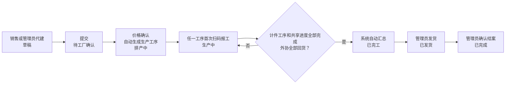
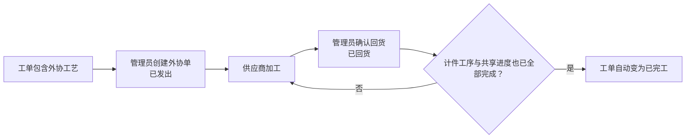

# 红包印刷 ERP 管理后台使用手册

> 适用版本：包含自动生成生产工序与工序计件结算的当前发布候选。旧任务、旧日薪和旧打包时薪仅作为历史档案查阅，不再用于新工单。
> 更新日期：2026-08-28
> 使用地址：<https://bag.sshapi.cn>

本文面向实际使用系统的同事，说明不同账号能做什么、工单如何在销售、管理员和师傅之间流转，以及外协、采购、库存、账单和工资如何衔接。

本文描述当前发布候选的既有功能；尚未发布部分已在页首注明。侧栏中显示为灰色、无法点击的项目属于待实现功能，不应作为当前工作流程使用。

## 1. 登录与账号

### 1.1 登录

1. 打开 <https://bag.sshapi.cn>。
2. 输入管理员分配的用户名和密码。
3. 登录后，系统会按账号角色自动进入对应工作台：

| 账号角色 | 登录后的默认页面 | 使用终端建议 |
|---|---|---|
| 管理员 | 工作台 | 电脑或平板 |
| 销售 | 我的工单 | 电脑或平板 |
| 师傅 | 我的任务 | 手机 |

请勿共用账号。工单提交、状态变化、报工和后台修改都会记录实际操作人，共用账号会导致责任记录和工资归属错误。

### 1.2 修改密码与退出

- 管理员、销售：点击右上角姓名或头像，选择“修改密码”或“退出登录”。
- 师傅端：顶部提供“退出登录”；需要修改密码时进入账号的“修改密码”页面。
- 新密码至少 8 位。管理员可以在“用户管理”中重置员工密码。
- 建议首次登录后立即修改初始密码。

账号停用后不能登录，但历史工单、报工、工资和操作记录都会保留。

## 2. 账号角色与功能边界

### 2.1 功能对照表

| 功能 | 管理员 | 销售 | 师傅 |
|---|:---:|:---:|:---:|
| 查看全部工单 | ✓ | — | — |
| 查看自己的工单 | ✓ | ✓，自己创建的 | ✓，与本人固定计件岗位或共享进度相关的 |
| 创建、提交工单 | ✓ | ✓ | — |
| 提交/审核工单修改申请 | 审核 | 提交自己的 | — |
| 工厂核价、查看生产进度 | ✓ | — | — |
| 扫码报工 | — | — | ✓，固定计件岗位或共享进度 |
| 创建和处理外协单 | ✓ | — | — |
| 取消工单 | ✓ | — | — |
| 发货、确认完成 | ✓ | — | — |
| 导出全部/筛选工单 | ✓ | — | — |
| 查看外部销售加工/快递/耗材应收账单 | 全部 | 自己的 | — |
| 查看师傅工资 | 全部 | — | 自己的计件工资 |
| 采购、库存、仓库 | ✓ | — | 当前工作台无操作入口 |
| 字典、账号、推送、运维 | ✓ | — | — |

### 2.2 管理员账号

管理员承担业务配置、生产核对、财务和运维管理。当前主要菜单包括：

| 菜单分组 | 功能 |
|---|---|
| 工作台 | 查看工单待办、交期预警、待发货工单及其他关注事项，了解今日工单和本月已出账金额 |
| 经营概览 | 查看近 30 天产量、本月销售排行和产品分布 |
| 工单 | 查看所有工单，按各项信息筛选/排序/分页，导出全部或筛选结果，完成工厂核价，查看工序进度，修改允许修改的信息，取消、发货、确认完成 |
| 工单修改申请 | 审核销售提交的款式名称、数量、规格、烫金颜色和新增款式申请 |
| 外协 | 创建外协单，登记外协回货或取消外协 |
| 采购单 | 创建采购单、分批收货、取消采购单或收货单 |
| 车间用料 | 查看物料库存和办理出入库 |
| 工时录入 | 为全体在职员工记录半天制上班/请假，可登记普通、加班工时供核对（不再生成时薪月结；空闲打包工时已随厨师岗位删除；已有历史打包时薪存档的月份考勤只读） |
| 账单 | 生成外部销售月度对客应收（加工费 + 快递费 + 打包耗材费）、发单、逐笔登记付款；管理员另行核对内部成本和毛利 |
| 薪资 | 锁定并发放工序计件结算，查阅历史日薪档案与历史时薪档案 |
| 客户/供应商 | 维护客户、供应商及默认联系人和地址 |
| 工艺、产品、分类、价格 | 维护录单和自动生成生产工序所需的基础资料；分别审计外部销售加工费与快递/耗材两本版本化价目簿 |
| BOM/用料 | 维护产品或分类的估算用料；目前不会自动扣库存 |
| 物料、仓库/库位 | 维护物料主数据、仓库、库位、调拨和盘点 |
| 用户管理 | 新建、编辑、停用账号和重置密码 |
| 推送配置 | 配置企业微信群及业务事件推送规则 |
| 后台任务 | 查看通知、定时结算和文件打包任务，重试失败任务（已删除功能的历史任务，如时薪月结、客服结算，只保留记录，不能重试） |
| CDR 汇总 | 按工单生成外协设计文件 ZIP 下载链接 |
| Pigsty 运维 | 查看数据库扩展、调度和分区预检；主要供运维人员使用 |

当前没有单独的“车间主任”角色。“外协、车间用料、工时录入”等车间页面实际权限都属于管理员。历史上的“排产”页面和按人派工流程不再用于新工单。

工作台每类关注事项最多预览 3 条，右上角数量是该类全部记录数。点击“查看全部”可打开同类完整列表并翻页；工单以工单名称为主、工单号为次（未填名称时只显示工单号），点击工单或供应商可进入对应详情。待发货的等待时长从完工日期起按上海日历日计算。“外部销售”表示工单归属的外部销售（免费重做显示原单的外部销售），不等同于当前跟进人。

“本月已出账金额”来自本月账单，不代表全部销售收入，也不包含其他月份的待收款。

### 2.3 销售账号

销售当前可使用：

- 创建工单；
- 查看自己创建的工单；
- 在允许的阶段修改自己工单的基本信息；
- 工单完工前，对已提交工单发起款式修改申请，由管理员审核后统一更新；
- 将自己的草稿工单提交给工厂确认；
- 在系统允许的阶段标记或取消急单标记；
- 打印工单或下载 PDF；
- 创建工单时由计价引擎读取当前已发布的加工费与物流价表，未覆盖项转管理员人工核价；
- 录单时按每票运单计算中通快递建议、确认纸箱等打包耗材费；
- 查看自己的月度对客应收账单、加工/快递/耗材分项和回款进度。

销售不能处理生产工序、处理外协、取消工单、发货或确认完成。如需这些操作，应联系管理员。新工单不需要销售或管理员指定师傅。

销售直接从“创建工单”进入业务流程，不再单独查价或询价。工单预览与提交由同一计价引擎从已发布价表生成明细；遇到“需人工确认”时，不得自行套用相邻档位，应交由管理员核价。价表编辑、发布和来源审计仍在规则配置中心完成。

### 2.4 师傅账号

师傅端针对手机使用，包含三个入口：

| 页面 | 用途 |
|---|---|
| 我的任务 | 查看本人固定计件岗位的待报工工序，以及全员共享、不计薪的其他厂内工艺进度 |
| 我的工单 | 查看与本人固定计件岗位或共享进度相关的工单和生产资料 |
| 我的工资 | 查看管理员已锁定的工序计件、发放状态和报工明细；旧工资单另列为历史档案 |

师傅分为四种岗位：

| 岗位 | 当前计薪和使用方式 |
|---|---|
| 开机师傅（开机仔） | 固定负责局部烫金；本人扫码报工，按合格完成数计件 |
| 开机师傅（风车机） | 固定负责专版烫金；本人扫码报工，按合格完成数计件 |
| 打包工 | 固定负责打包入袋；本人扫码报工，按完成袋数计件 |
| 其他车间岗位 | 可查看并上报共享的厂内工艺进度；这些进度不产生计件工资 |

账号岗位决定固定计件工序，不再按工单派人，也没有改派或抢单。每次报工都归当前登录账号；同一工序可以由多人分批完成，但任何人都不能借用他人账号代报。

## 3. 工单完整流转

工单主状态和生产工序状态相互关联：

- 工单状态表示整张订单走到哪一步；
- 生产工序状态表示某道计件工序或共享进度累计做到哪一步，不代表工单分配给了某个人。

### 3.1 工单状态说明

| 页面状态 | 含义 | 下一主要操作人 |
|---|---|---|
| 草稿 | 已保存，尚未提交 | 销售（或代建的管理员）检查并提交 |
| 待工厂确认 | 等待工厂核对价格；有待人工核价项目时必须先录入并确认终价 | 管理员 |
| 排产中 | 价格已确认，系统已自动生成生产工序；此名称为界面沿用的状态名，不表示还要人工排产或派工 | 对应岗位师傅 |
| 生产中 | 至少一道计件工序或共享进度已经扫码报工 | 师傅/管理员 |
| 已完工 | 全部计件工序、共享进度完成，所需外协也已回货 | 管理员发货 |
| 已发货 | 货物已经发出 | 管理员确认结案 |
| 已完成 | 已交付并关闭，进入账单归集范围 | 无，终态 |
| 已取消 | 工单作废 | 无，终态 |

### 3.2 生产工序状态说明

| 页面状态 | 师傅操作 |
|---|---|
| 待报工 | 打开工序，核对生产资料后填写本次完成数并提交扫码报工 |
| 进行中 | 已有部分报工但累计合格数未达到计划数，可继续分批报工 |
| 已完工 | 累计合格数已达到计划数，只读，不能继续报工 |
| 已取消 | 随工单取消而关闭，只读，不能报工 |

局部烫金、专版烫金和打包入袋是计件工序。其他厂内工艺显示为“进度·不计薪”，由启用中的车间账号共享上报。外协不进入这两类工序，由独立外协单记录发出、回货和付款。

## 4. 销售操作步骤

### 4.1 创建工单

1. 进入“创建工单”。管理员代建时先在「关联外部销售（必填）」中选择启用的外部销售；寄样品、打样同样要选择（样品表单里有同一下拉）。没有启用的外部销售账号时页面只显示提示，先到“用户管理”创建或启用。
2. 填写工单自定义名称和一组主收货信息（“客户名称/简称”已于 2026-09-27 停用，不再填写）；只有确实分寄时才展开“多地址发货”，为额外地址分配各款数量。
3. 填写承诺交期、包装要求、备注，按需要标记急单或“顺丰到付”。顺丰到付表示内部自行预约：外部销售的对客快递费固定为 ¥0，但纸箱、胶带、防水袋等打包耗材仍需确认并收费。
4. 添加一个或多个款式，选择“报价产品”，填写款式名称、数量、单双面/单双色和工艺；规格、纸张、烫金颜色优先直接点选，烫金颜色可多选，特殊订单使用各字段的自定义项。
5. 点击“计算并应用建议价”核对基础价和各收费项。完整规则会得到“成交单价 + 一次性费用 = 建议小计”；也可直接留空价格，由保存时的服务端权威报价自动应用。数量低于产品最小起订量时系统不会静默给自动价；特殊小批量单、人工成交价与建议价不同，或其他报价规则不完整时，必须填写人工改价说明。
6. **仅外部销售工单**：在每个发货地址选择“中通计费省份”，填写承运商已进位的计费重量，再点“计算全部地址建议费”。快递费按每票首重/续重计算；纸箱金额只是参考，销售必须确认最终打包耗材费。金额与建议不同、数量超过 5000 个或价目未覆盖时，必须填写“收费调整说明”。当前结构化运费只支持中通与顺丰到付，其他承运商不得套用中通价目。
7. 检查加工费、每票快递/耗材、工艺和收货分配后保存。系统会在事务内使用数据库当前有效价目重新核价，保存加工与物流两种版本快照，生成工单号并进入“草稿”。
8. 如有图片或 CDR 设计文件，在草稿阶段进入工单详情，按款式上传；设计图支持从剪贴板直接粘贴。上传后用放大预览核对，不能只看文件名。

注意：

- 设计文件只有在“草稿”状态才能增删，提交前务必检查完整；
- 多地址工单每款分配到各地址的数量之和必须等于款式总数量；默认单地址无需展开额外表单；
- 快递收费的粒度是“运单/包裹”而不是“唯一收件地址”。同一地址如果发两个运单，必须在录单时复制为两条发货记录，否则系统只会计一次首重；
- 不要把秤上原始重量直接填入计费重量。原报价表没有规定如何进位，应使用承运商确认的整 kg 或 0.5kg 档值；
- 款式关键备注会以红色高亮，并随彩色打印/PDF 保留；只把真正影响生产的内容写进关键备注，避免整段普通说明全部标红；
- 普通编辑页只修改工单顶部和履约信息；款式名称、数量、规格、烫金颜色或新增款式走“修改申请”，不能直接覆盖；
- 修改申请不能改纸张、工艺或单价；这些字段录错时应在任何生产工序报工前联系管理员评估取消并重建，不能用备注代替结构化数据；
- 停用的产品或工艺不会出现在新建工单选项中，但不会影响历史工单。

### 4.2 提交工单

1. 打开“我的工单”，进入目标草稿。
2. 检查外部销售、交期、款式、数量、工艺、金额和设计文件。
3. 点击“提交工单”。
4. 价目完整的工单会确认价格并自动生成生产工序；有待人工核价项目的工单显示“待工厂确认”，管理员确认终价后再自动生成生产工序。

提交后仍可在允许阶段修改顶部信息，但不能再增删设计文件。款式数据不得直接覆盖，应走修改申请；收货信息变动应联系管理员处理。

### 4.3 跟踪工单

在“我的工单”中查看状态：

- “待工厂确认”：价格尚未确认，生产工序还不会生成；
- “排产中”：价格已确认、生产工序已自动生成，等待首次扫码报工；这是界面沿用的状态名，不需要管理员再派工；
- “生产中”：至少一道计件工序或共享进度已有报工；
- “已完工”：生产和外协都已结束，等待发货；
- “已发货”：货物已发出；
- “已完成”：已结案，会按结案月份进入月度账单；
- “已取消”：工单已经作废。

外部销售还可以在工单详情查看每票“创建时估算 / 已确认 / 已免收”的快递与耗材收费、系统建议、实际收费、调整说明和价目版本。这些是外部销售应付工厂的对客收费，不是工厂已支出的快递/材料成本。

销售在“我的账单”查看管理员生成的月度账单、加工费、快递费、打包耗材费、其他对客收费、应付总额、已付金额和结清状态。销售端只能查看本人账单且为只读；发单和登记付款由管理员操作。

打印前应在工单详情确认自定义名称、设计图、红色关键备注、多色烫金和全部收货地址。恰好三款时系统会使用 A4 紧凑布局；仍应在预览中确认只有一页且文字/图片未被裁切，再交付打印。

### 4.4 申请修改已保存/已提交工单

工单尚处于草稿、已提交、排产中或生产中时，原提交人可以在详情页“申请修改工单”区域发起申请：

1. 勾选要修改的现有款式，可改款式名称、数量、规格和多色烫金颜色；
2. 如需增加款式，勾选“本次申请需要新增一款”，选择参考款式并填写新名称、数量、规格和烫金颜色；新增款继承参考款式的产品、纸张和工艺，批准时按新数量和条件重新报价；
3. 填写修改原因并提交。管理员批准前，当前工单和各端口看到的内容都不会变化；
4. 同一工单已有待审核申请时不能重复提交。已完工、已发货、已完成或已取消后不能再申请。
5. 只要有任一收货地址已发货，修改申请只能改交期，也不再提供“申请取消”：发货后正常收费，没有取消选项。
6. 尚未提交的外部销售草稿（包括管理员代建的草稿）改数量或规格时只重算加工费；快递与耗材收费在提交时按当时的物流价目生成。

管理员在“工单修改申请”或工单详情审核。批准时系统会重新核对工单版本，并在同一事务更新允许修改的款式信息、收货数量分配和工单金额；拒绝不会改工单。以下情况会阻止批准：

- 申请基于旧版本，状态显示“版本已过期”；
- 修改会影响已经自动生成的生产工序，或工序已经有报工记录；
- 工单状态已经不允许修改。

遇到阻断时不要反复提交。管理员应先核对生产、收货数量与财务流水，再决定重新申请、取消重建或做前向校准。

## 5. 管理员生产确认与进度管理

### 5.0 工单筛选、排序与导出

1. 打开“工单”时，默认按创建日期从新到旧排列；创建时间相同时仍保持稳定顺序。点工单号、金额或创建日期表头可切换排序。
2. 常用区可筛综合搜索、状态、创建日期、提交人和急单；“更多筛选”包含工单/收件/发货、金额/交期、款式/工艺/烫金色和外协信息（“客户名称/简称”已于 2026-09-27 停用，不再作为筛选或搜索条件）。页面若仍提供“师傅、任务、机型”等条件，它们只用于检索历史派工档案，不代表新工单仍要按人分配。
3. 金额、数量或日期范围填反时，页面会明确报错并忽略该组范围，不会把列表静默筛成 0 条；请改正后再应用。
4. 管理员可选“导出筛选结果”或“导出全部工单”。文件由后台任务生成，页面会显示“生成中”；完成后在“最近导出”下载。不要连续重复点击。
5. XLSX 按工单、款式、生产记录、收货地址、地址款式分配、外协、成本、修改申请、操作记录、设计文件和账单关联分表，金额不会因多地址或多条生产记录重复累加。导出中标为“历史任务”的内容只供旧单追溯；设计文件只导出元数据，不导出文件下载地址。
6. 文件含收件人、电话、地址等个人信息，仅导出发起人本人能下载，生成完成后 24 小时过期。下载后应存入受控位置，不要发到无关群聊。

### 5.1 价格确认与投产条件

新收费工单进入生产前必须同时满足：

1. 工单已经提交，设计图和生产参数完整；
2. 每一项收费都有已确认金额；价目未覆盖时，由管理员在工单详情的“工厂核价确认”录入金额并确认终价；
3. 工单使用的纸张、规格、工艺和包装数量能形成明确生产事实；
4. 工艺处于启用状态，外协工艺已正确标记为外协；
5. 正式报计件前，局部烫金、专版烫金和打包入袋三类工价已有生效版本。缺少工价时系统会阻止按零元报工，不能临时口头套价。

管理员不需要寻找“匹配师傅”。应在“用户管理”提前为账号设置固定岗位：开机仔对应局部烫金，风车机对应专版烫金，打包工对应打包入袋。岗位设置决定师傅端长期可见的计件工序，不针对单张工单临时改变。

### 5.2 确认并下发生产

- 管理员先完成工厂确认；价格已确认不代表已经下发生产；
- 工作台“待下发生产”显示已确认且没有待审核变更的工单，点击后进入对应工单筛选列表；
- 在工单中执行“下发生产”，服务端通过价格、版本、变更和生产事实校验后，生成当前版本生产工序及首次打印请求；
- 系统按整单需要生成局部烫金、专版烫金和打包入袋计件工序；同类来源合并到对应工序，并保留款式或包装组来源；
- 其余厂内工艺按“款式 × 工艺”生成共享的无计件进度；
- 外协工艺不生成厂内进度，继续由外协单独立管理；
- 下发后进入“已下发”状态。历史“排产中”不是等待人工派工，不纳入“待下发生产”；当前流程没有管理员分配师傅的步骤。

### 5.3 管理员查看生产进度

管理员在工单详情核对三类信息：

- “生产工序”展示三类计件工序的计划量、累计合格数、缺陷数、返工数和报工人；
- “无计件进度（不计薪）”展示其他厂内工艺的累计进度；
- “外协”展示供应商发出、回货和付款状态。

管理员只负责核对和处理异常，不代替师傅报工，也不把工序指派给个人。账号岗位设置错误时，应先停报并修正账号；已经产生的报工属于实际登录人，不能通过改岗位或改工单归属回写。

### 5.4 审核工单修改申请

1. 进入“工单修改申请”，优先处理“待审核”；
2. 打开申请对应工单，核对申请人、修改原因、基于版本、当前版本及逐款差异；
3. 先查看只读的“审批计价预览”，核对旧总额、新总额、差额和每款结果，再确认生产、交期、收货数量、销售额和成本影响后批准或拒绝。数量、规格、烫金色或新增款式会按当前完整规则重新报价；预览不入账，点击批准时服务器还会在事务内再算一次。规则不完整而需沿用旧成交价时，批准必须填写清晰审核备注；
4. 批准后刷新工单和相关端口核对结果；出现“版本已过期”或“生产工序已生成/已有报工”阻断时，按 4.4 的边界处理，不能绕过审核直接改数据。

## 6. 师傅扫码报工

### 6.1 找到要做的工序

1. 登录师傅工作台，打开“我的任务”。
2. 先看急单标记，再核对工单号、交期和生产备注。
3. 固定计件岗位只显示与账号岗位一致的工序：开机仔看局部烫金，风车机看专版烫金，打包工看打包入袋。
4. “进度·不计薪”是其他厂内工艺的共享进度，所有启用中的车间账号都能看到并按实际生产上报。

新工序没有“接单”“抢单”或“开始生产”按钮。打开工序即可报本次实际数量；第一次成功报工后，工序和工单会自动进入进行中/生产中。看到不属于固定岗位的计件工序时不要操作，应联系管理员检查账号岗位。

### 6.2 上报计件工序

1. 扫码或从“我的任务”打开工序，核对工单、款式/包装组、生产资料和剩余数量。
2. 填写“本次合格完成数”“本次工单件数进度”“缺陷数”和“返工数”。完成数和进度默认为空，须按本批实际数量填写；没有新增工单进度时填写 0。
3. 点击“提交扫码报工”，核对数量和提交影响后点击“确认报工”；需要修改时点击“返回修改”。
4. 系统把本次报工追加到当前登录账号名下，并按当时生效的工价版本保存计件金额。

只有合格完成数进入计薪数量；缺陷数和返工数只保留为质量记录，本期不计薪。同一工序可由多人分批报工，累计合格数达到计划量后自动变为“已完工”。报错数量时不要重复提交抵消，应立即记录工单和报工时间，交系统管理员追加冲正记录。

打包入袋按系统生成的实际袋数报工，混装不另分工价档。局部烫金需要多次烫印时，系统依据工序来源和已发布工价换算计薪数量，师傅只填写实际完成数量，不自行计算金额。

师傅“我的工资”页将已结算工资与“未结算报工”分开展示。未结算明细仅展示本人流水，支持日期筛选、分页，并标明待核定、工序未完成或待结算；人工调整和冲正单独列出，负金额保持原符号。暂计提成尚未结算，不代表已发工资。

### 6.3 上报共享生产进度

1. 打开带“进度·不计薪”标记的厂内工艺；
2. 填写本次合格完成数、缺陷数和返工数；
3. 提交后只推进该工艺进度，不产生计件工资；
4. 累计合格数达到计划量后，该进度自动完工。

当全部计件工序、共享生产进度都完成，并且所需外协均已回货时，系统自动把工单变为“已完工”。师傅不能手动修改工单主状态。

### 6.4 查看工资

局部烫金师傅、专版烫金师傅和打包工在“我的工资”查看管理员已经锁定的工序计件：

- 按日期筛选结算；
- 报工金额、调整、应发金额和发放状态；
- 每条报工对应的工单、工序、合格/缺陷/返工、计薪数、工价和金额；
- 报工时锁定的工价版本。

刚完成的报工在管理员按日锁定前不会出现在结算列表。旧开机日薪和旧打包时薪会明确显示为“历史档案”，只供查阅，不与新工序计件合并。

### 6.5 历史任务与工资档案

- 切换前已经生成的旧任务会明确标为“历史任务”，只展示原工艺、人员、数量、状态和原计件快照，不能再开始、报工、改派或抢单；
- 切换前已经生成的旧日薪和旧打包时薪只展示原金额与发放状态，不再重算、调整或标记发放；
- 新工序报工只进入工序计件结算。核对成本或工资时不得把历史档案与新账本重复相加。

## 7. 外协流程

外协工艺不会生成计件工序或共享厂内进度，而是通过独立外协单管理。

操作要求：

1. 管理员在工单详情点击“外协”，选择关联款式并填写外协厂、工艺、预计回货日期和要求。总数量由系统从所选款式计算且不可手改；供应商报价尚未确定时，应付金额可以暂时留空。
2. 新建外协单后默认状态为“已发出”。
3. 报价或最终对账金额确定后，在外协单详情的“外协金额确认”补录；后续更正必须填写原因，系统会保留旧金额、新金额、操作人和时间，不能用“其他成本”重复补一笔。对客价格字典不用于供应商应付。
4. 供应商回货后，管理员进入外协单点击“标记回货”。
5. 回货且应付金额确认后，管理员按实际付款逐笔登记时间、金额、方式、流水号和备注；系统显示累计已付/未付并阻止超付。
6. 当前操作界面支持从“已发出”直接标记为“已回货”，或在尚未回货时取消外协单；已取消外协单不能再修改金额或付款。
7. 纯外协工单没有厂内工序或共享进度；价格确认后页面仍会沿用“排产中”状态名，最后一张有效外协单回货后可直接变为“已完工”。

以下情况会被系统阻止：

- 工单中的外协工艺尚未被有效外协单覆盖时，不能完成整单生产；
- 仍有“已发出”或“进行中”的外协单时，不能发货；
- 仍有“已发出”或“进行中”的外协单时，不能直接取消工单。

## 8. 发货、结案与取消

### 8.1 发货和结案

只有管理员可以操作：

1. 工单自动变为“已完工”后，在详情页为每个地址/运单填写运单号和快递重量；多地址必须一次提交与系统顺序一致的完整清单；
2. 外部销售工单还要逐票确认中通计费省份、承运商最终计费重量、对客快递费和打包耗材费。系统使用该工单创建时冻结的物流价目重算，与建议不同时必须填调整说明；
3. 顺丰到付的对客快递费必须为 ¥0，但打包耗材费仍必须确认。发货成功后，每票收费从“创建时估算”转为“已确认”（顺丰快递行为“已免收”），工单变为“已发货”；
4. 客户确认收货、交付和对账完成后，管理员点击“确认完成”；
5. 工单变为“已完成”，成为终态。外部销售工单如果缺少完整快递/耗材收费快照，系统会阻止结案，不允许先进账单再补猜收费。

只有“已完成”且结算方向为“外部销售应付工厂”的收费工单，才会按 `finishedAt` 所在月份进入外部销售月度账单。免费重做单不生成应收。不要把“已完工”当作业务结案。

顺丰到付统一表示“顺丰到付、内部自行预约”：不计对客快递费，但对客打包耗材费仍照常确认。管理员可在已完成/已取消前独立补录或取消该标识并留下工单日志；外部销售工单一旦已发货，只有管理员可以更正该标识。已发货工单取消到付时，必须逐票补齐中通计费省份和承运商最终计费重量；实际快递费可留空按该工单冻结价目重算，人工金额与建议不同时必须说明原因。如果工单已经存在工厂物流成本流水，系统会阻止改为顺丰到付，应先由财务核对，不能删历史流水。

### 8.2 取消工单

只有管理员可以取消工单。取消前必须检查生产和外协状态：

- 全部计件工序和共享进度都还没有报工时，可以取消；所有“待报工”工序与进度会同时变为“已取消”；
- 只要计件工序或共享进度已有报工，不能直接取消，必须先核实并处理生产、计件和工资记录；
- 有“已发出”或“进行中”的外协单时，必须先处理外协单；
- “已完成”和“已取消”是终态，不能继续流转；
- 任一收货地址已发货后，不提供直接取消，也不能批准取消申请（只能拒绝），工单正常收费。

如销售发现错误，应尽快通知管理员，并提醒车间暂停扫码报工。任何工序已有报工后，系统会阻止直接取消。

### 8.3 已发货/已完成工单的售后重做

原工单出现质量问题或物流损毁时，不要把原单退回生产状态，也不要修改原应收或历史工资。管理员在原工单详情“发起重做排单”：

1. 选择质量问题、物流损毁或其他原因，并填写详细说明；
2. 勾选需要重做的款式、数量和工艺，重做数量不能超过原款数量；加工工艺可全部取消勾选，表示本次只重新打包/入袋；
3. 创建后生成一张关联的零收费“重做单”，系统根据本次勾选的工艺直接生成生产工序，按普通工单继续报工和处理外协；
4. 重做单不增加客户应收，但师傅生产仍正常计件，相关成本回归原单账单的售后重做成本。

只能从已发货或已完成的原单发起。重做单不能再嵌套重做；后续仍有问题时回到最初原单再建另一张重做单，保证成本归集不漏层级。

历史原单如果没有结构化包装组，系统优先复用该款已保存的“每袋数量”；连该值也缺失时，页面会要求管理员显式补录。补录只写入新重做单的快照，不回写原单；已有包装组不允许被补录值覆盖。

## 9. 采购与库存流程

### 9.1 基础关系

### 9.2 操作原则

- 创建采购单只记录采购承诺，不会增加库存；
- 实际到货后，应在采购单详情中创建收货单；
- 只有“收货过账”才会增加对应物料和库位库存；
- 支持分批收货，采购单状态会从“已下单”变为“部分收货”，全部收齐后变为“已收货”；
- 取消已经过账的收货单会产生反向库存记录，不要通过手工修改物料主数据纠正库存；
- 库存调拨用于不同仓库或库位之间移动库存，不改变公司总库存；
- 库存盘点提交后会根据账面数和实盘数生成差异流水；
- BOM 当前只提供用料估算，不会在工单报工或完工时自动扣库存。

## 10. 账单与工资流程

### 10.1 外部销售对客应收账单

- 系统按上海时区的自然月，只将当月“已完成”且结算方向为“外部销售应付工厂”的收费工单按外部销售归集；
- 每张工单的应收合计 = 加工费 + 快递费 + 打包耗材费 + 其他对客收费。销售端和管理员端都按这些分项展示，不再把总额全部叫做“加工费”；
- 每位外部销售每月一张账单；
- 草稿账单由管理员核对后发单；
- 登记回款时累计已付金额，不能超过账单总额；
- 结算后发现金额不对（业主 2026-10-01）：月账单确认前，在工单详情「计价与收费维护 › 结算更正」录正数（少收补上）或负数（多收退回），系统另记一行「结算更正」并更新草稿账单，最低只能更正到加工费；月账单确认后，在账单工单行「录入抵扣或补收」，多收录抵扣、少收录补收，计入之后最早的草稿账单；
- 迁移前只有累计已收、无法还原逐笔日期的记录会明确显示“历史期初 · 时间未知”，不要把占位时间当作真实收款时间；
- 每次回款都保存时间、金额、方式、参考号和备注，不能用覆盖累计金额代替逐笔明细；
- 管理员账单详情先拆开对客加工费、对客快递费、对客打包耗材和应收合计，再单独展示历史期初/手工差额、计件、外协、材料、工厂物流、上板/装板、伙食、电费、其他自定义、售后重做成本与毛利；原单和重做单的补录成本都列出来源单号、数量、单价、录入人和时间；
- 计件和外协成本由生产/外协流水自动汇总，不要再手工重复录入。普通补录成本必须为正数；差错使用新的“成本调整”正数或负数冲正，保留原流水；数量和单价同时填写时必须满足“金额 = 数量 × 单价”；
- 顺丰到付工单的对客快递费为 ¥0，打包耗材费仍进应收；工厂实际支出的快递/耗材成本属于独立的工厂成本账，不得用删除对客收费或互相抵销的方式凑毛利；
- 销售侧只能查看自己的应收、回款和工单，不能发单或登记付款，也看不到工厂计件、供应商、员工、伙食、电费等内部成本。

### 10.2 工序计件结算

新计件只覆盖局部烫金、专版烫金和打包入袋，按实际报工人结算，不按工单归属或人员分配结算：

1. 师傅扫码报工时，系统按工序类型、合格完成数和当时生效的工价计算金额，并保存工价版本快照。缺陷数、返工数本期不计薪；
2. 管理员进入“薪资 → 工序计件结算”，选择已经结束的上海日历日，查看每位报工人的待锁定报工；当天和未来日期不能提前锁定；
3. 管理员可以逐人点击“锁定结算”，也可以“锁定当日全部”；锁定前核对报工人、工序、报工条数、工单数和金额；
4. 锁定后进入详情复核每条报工的合格/缺陷/返工、计薪数、工价、金额和工价版本；锁定明细不能删除或重建，差错由系统管理员追加冲正记录，不能覆盖原报工；
5. 线下实际付款完成后点击“标记已发”。该按钮只记录发放状态，不会自动转账；已发放结算不能撤销或覆盖；
6. 需要留档时使用“导出新账本”，不要把历史日薪导出与新账本相加。

本期管理后台不提供三类计件工价的日常编辑页面。正式启用前须由系统管理员发布有效工价版本；任何一类缺价都会阻止按零元报工或结算。新账本没有按人覆盖工价、按机型日薪、日保底或“重算日薪”步骤。

“历史日薪档案”仅展示切换前已经生成的开机师傅工资快照；“历史打包时薪档案”仅展示切换前已经生成的打包工资快照。两者均只读，不再重算、调整或发放，也不与新工序计件合并。

### 10.3 全员考勤

- 账号需先维护用工类型。管理员在“工时录入”按上海自然日记录实际上班和请假，支持 0、0.5、1 天；同一天两者合计不能超过 1 天。
- 全体在职正式员工的工资详情会显示实际上班/请假天数。开机师傅和打包工的考勤目前只用于核对，不自动增减工序计件。
- 已有历史打包时薪月结存档的月份，考勤整月只读，不能新增、修改或删除。
- 录错考勤应删除/更正当天记录，不要在下个月用虚假天数抵消。新工序报工在发生时锁定报工人、工序和工价版本；员工之后改岗或停用，已有报工不按当前岗位重算。切换前的旧任务和工资也仅按其历史快照展示。

### 10.4 对客价格与工资规则配置

- “价格”中的可编辑阶梯/加价规则是历史兼容资料（2026-09-24 起不再有内部销售与工厂直单，所有收费工单都按外部销售价目计价）：先在产品中设置可选基础单价和最小起订量，再按产品和数量档位维护价格阶梯，最后维护按个、按张、每万个或每款一次的收费项。外部销售不会回退使用这些兼容规则。
- 收费项可按产品、工艺、规格、纸张、烫金颜色、单双面、单双色、数量区间和结算方向限定；“按张”必须填写每张可生产数量。保存前页面会拒绝未知字段或错误类型。
- 外部销售收费从左侧“外部销售收费”进入。先切换“加工费”或“快递与打包耗材”，再按项目名、类目、产品/地区、数量、计价方式、自动/人工和启停状态筛选。卡片同时显示当前价与草稿价；点“查看 / 编辑”后在右侧（手机端为列表上方）修改草稿项目。
- 调价前先填写原因并“复制为新草稿”；保存单个收费项目不会立即影响工单。全部核对后到“发布中心”校验、生效或放弃草稿。已发布版本和历史工单金额禁止原地修改。规则来源和校验信息只在审计记录中保存，日常管理页面不要求管理员填写。
- 物流价目来源已锁定：`长昆中通报价表(1).xlsx`，SHA-256 `a92088a9ba0093afcbb96c6b3b182ab29e4f7d675cacf929c6745987bf4d6060`，工作表“中通” `A1:D29`；`纸箱价格表1(1).xlsx`，SHA-256 `9f0c30333a737ab9d36398b8af2c84ece599317f9df21af5dacb8f365fa5401b`，工作表“Sheet1” `A1:B6`。文件名相同但哈希不同时必须视为新来源，不能冒充旧版本。
- 中通按每票的省份和承运商计费重量核价；纸箱表只是打包耗材建议。纸箱表未说明按箱数、工单、款式还是地址收费，所以管理员不得把建议金额宣称为“自动确认的纸箱成本”。
- “薪资 → 工资规则”只维护标准工时与加班起点。三类工序计件使用独立的版本化工价簿，本期由系统管理员发布，不在工资规则页面按人或按机型维护。
- 新规则按生效时间创建版本。已保存的工单报价、报工计件和工资单使用各自快照，不会被后来改价回写。
- 客户售价、员工工资、外协供应商应付是三套规则/账本；不要把同一个金额复制到不同模块凑平。

## 11. 管理员首次配置检查表

新环境或新业务上线前，管理员按以下顺序检查：

1. 在“用户管理”创建销售和师傅账号（管理员建单必须归属一个启用的外部销售账号）；
2. 为师傅选择固定岗位；开机仔负责局部烫金，风车机负责专版烫金，打包工负责打包入袋。不要通过附加设备能力把一个账号临时扩展到其他计件工序；
3. 在“客户/供应商”维护客户和供应商；
4. 在“产品分类、产品字典、工艺字典”维护录单选项；
5. 确认内部工艺处于启用状态；除三类计件工序外，其他内部工艺会生成全员共享、不计薪的生产进度；
6. 为外协工艺打开外协标记，避免错误生成厂内进度；
7. 在“薪资 → 工资规则”维护工作时段；联系系统管理员确认局部烫金、专版烫金和打包入袋三类工价已有生效版本；
8. 在“物料、仓库/库位”维护库存基础资料；
9. 在“产品”配置基础单价，在两个外部销售价目入口分别核对加工费与快递/耗材的来源、版本和未决警告；按需要维护 BOM；
10. 在“推送配置”创建企业微信群并启用对应事件规则；
11. 创建一张测试工单，完整走通提交/核价、自动生成工序、三类固定岗位扫码报工、共享进度、外协回货、计件锁定/发放、发货和完成。

## 12. 常见问题

### 为什么销售看不到其他人的工单？

这是权限设计。销售只能查看自己的工单；管理员可以查看全部工单。

### 为什么师傅看不到某张工单？

先确认工单价格已经确认并自动生成生产工序。计件工序按账号固定岗位显示：开机仔只看局部烫金，风车机只看专版烫金，打包工只看打包入袋；其他厂内工艺作为共享进度向启用中的车间账号显示。纯外协工单不会生成厂内工序。

### 为什么工单提交了，师傅仍看不到？

如果工单显示“待工厂确认”，说明价格尚未完成确认，生产工序不会提前生成。管理员完成工厂核价后，工序会自动出现；无需再排产或派工。如果价格已确认仍看不到，应检查工艺是否启用、账号岗位是否正确以及工序是否已经完工或取消。

### 为什么没有排产、派工或抢单入口？

新流程不做人员与工单匹配，也不做产能排程。价格确认后，系统自动生成生产工序；账号的固定岗位决定可见工序，实际扫码账号决定报工与计件归属。历史排产、派工、改派和抢单页面不再用于新工单。

### 为什么页面仍显示“排产中”？

这是界面沿用的工单状态名，现在表示“价格已确认、生产工序已生成、等待首次报工”，不代表管理员还需要选择师傅。首次成功报工后，工单会自动变为“生产中”。

### 为什么工单一直显示“生产中”？

至少还有一道计件工序或共享生产进度未达到计划合格数，或关联外协单尚未全部回货。管理员应在工单详情分别检查“生产工序”“无计件进度（不计薪）”和“外协”。

### 为什么不能发货？

工单必须先达到“已完工”，并且不能存在“已发出”或“进行中”的外协单。

如果是外部销售工单，还要检查每条发货记录都有且仅有一条快递费和一条打包耗材费，重量/省份/金额满足冻结价目，人工差异已填写说明。顺丰到付的快递费必须为 ¥0，但耗材费不能留空。

### 为什么快递费或耗材费显示“需人工确认”？

常见原因是计费省份或重量缺失、重量没有对齐报价表的 1kg/0.5kg 档、使用非中通承运商、港澳台/海外地址，或者单票分配数量超过 5000 个。这是价目没有明确口径，不是系统卡顿。请根据承运商/耗材实际报价手工填金额并说明原因，不要套最近档位。

### 为什么顺丰到付还有打包耗材费？

“到付”只表示快递费由收件方向顺丰支付，不会让纸箱、胶带、防水袋和标签消失。因此外部销售应付工厂的快递费为 ¥0，打包耗材仍按实际确认进入账单。

### 为什么不能取消工单？

通常是因为计件工序或共享进度已经报工，或仍有进行中的外协单。系统阻止直接取消，是为了避免生产记录、外协成本和工资归属不一致。切换前旧单若提示“历史任务已开工/报工”，同样需要先核对历史档案。

### 为什么师傅报工后没有工资？

先确认报工属于局部烫金、专版烫金或打包入袋，并且报工时已有有效工价。新报工不会立即生成可见工资；管理员需要在次日进入“工序计件结算”按报工人锁定，锁定后才显示在师傅“我的工资”。不要为了催出工资重复报工。共享进度（无计薪步骤）不计件；清废、厨师岗位与时薪月结已于 2026-09-24 删除。

### 为什么没有“报价查询”菜单？

销售直接进入“创建工单”（管理员代建时先选择外部销售）。建单预览和提交使用同一套已发布价表与计价引擎；价目没有覆盖的项目会转工厂人工核价，不再提供独立询价入口。

### 操作后页面没有立即变化怎么办？

先等待按钮完成处理，不要连续重复点击；随后刷新当前页面确认状态。如果仍未变化，记录工单号、页面、操作时间和错误提示，交给管理员检查“后台任务”或联系技术人员。

## 13. 异常上报需要提供的信息

遇到问题时，请提供：

- 登录账号姓名和角色；
- 工单号、生产工序/共享进度或外协单号；旧单问题请注明“历史任务”；
- 操作页面；
- 操作时间；
- 点击了什么按钮；
- 页面完整错误提示；
- 必要时附截图，但不要在群里发送密码或完整敏感客户信息。

涉及报工、工资、回款、库存的异常，不要通过重复提交来“试一下”。重复操作可能形成重复业务记录，应先由管理员或技术人员核对。
